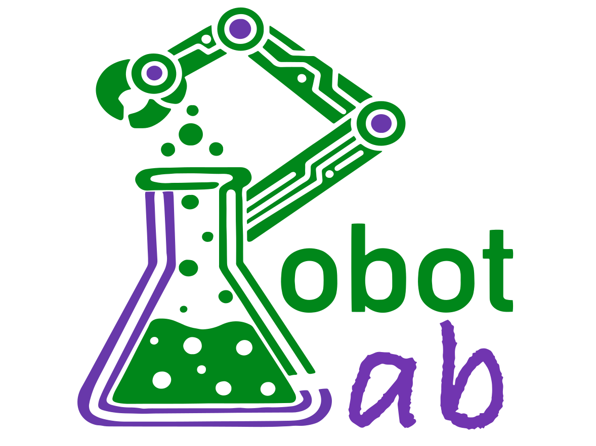

  

# RobotLab
Open-source Robotics

  <a href="https://www.instagram.com/teamrobotlab/?utm_source=ig_web_button_share_sheet">
    
    Follow us on Instagram
  </a>

  

For the English version, [click here](#welcomeen)

- [🤖 Welcome! [EN]](#welcomeen)
- [📦 Projects](#projects)
- [📜 License](#license)

Para a versão em Português, [clique aqui](#welcomept)

- [🤖 Bem-vindo! [PT]](#welcomept)
- [📦 Projetos](#projetos)
- [📜 Licença](#licenca)

 

## 🤖 Welcome! [EN]

RobotLab is a robotics team created to make knowledge more accessible. We started as part of an academic project, but with a vision that goes beyond the classroom: to develop technology, share our progress, and compete at a high level.

Currently, our main focus is developing solutions for the autonomous Mini Sumo category, where we design and build robots capable of sensing, deciding, and acting independently. At the same time, we are always open to new ideas and project suggestions.

Our work is fully open, and you can explore, follow, and contribute to our development here on GitHub.

📍 Based in Rio de Janeiro, Brazil.

Creators

  <a href="https://www.instagram.com/_brug.a/">
    
    Bruna Antunes
  </a>
  &nbsp;&nbsp;&nbsp;
  <a href="https://www.instagram.com/luiz_fbezerra/">
    
    Luiz Felipe Bezerra
  </a>

## 📦 Projects

### MAR — Remote Activation Module
- 💻 **Software:** [✅ Available ](https://github.com/Bru-antunes/RobotLab/tree/main/software/MAR)
- 🔧 **Hardware:** [✅ Available ](https://github.com/Bru-antunes/RobotLab/tree/main/hardware/MAR)
- 📚 **Documentation:** [✅ Available ](https://github.com/Bru-antunes/RobotLab/tree/main/docs/MAR)

A remote activation system designed to control and initialize electronic devices, especially in autonomous robots. The module ensures reliable, faster and safe triggering.

---

### Digital Infrared Sensor RL001 
- 🔧 **Hardware:** 🛠️ Ongoing  
- 📚 **Documentation:** 🛠️ Ongoing  

A digital infrared-based sensor for object detection and proximity sensing. Designed for mobile robotics applications, such as opponent detection in mini sumo robots and obstacle sensing.

---

### Line Sensor RL002
- 🔧 **Hardware:** 🛠️ Ongoing  
- 📚 **Documentation:** 🛠️ Ongoing

A sensor dedicated to line detection (light/dark contrast), used for navigation and boundary detection in autonomous robots.

---

### DarwinFlow Architecture
- 💻 **Software:** 🛠️ Ongoing  
- 📚 **Documentation:** 🛠️ Ongoing

A modular software architecture designed to standardize and scale robot code. DarwinFlow organizes sensor reading, decision-making, and actuator control, improving maintainability, testing, and system evolution.

---

### Orion — ESP32-S3 Integrated Board
- 🔧 **Hardware:** 🛠️ Ongoing  
- 📚 **Documentation:** 🛠️ Ongoing

An embedded board based on the ESP32-S3, designed to integrate processing, communication, and control into a single system. Focused on high performance for applications with multiple sensors and more advanced logic.

---

### Sakura — Arduino Nano Modular Board
- 🔧 **Hardware:** 🛠️ Ongoing  
- 📚 **Documentation:** 🛠️ Ongoing

A modular platform based on the Arduino Nano. It allows easy integration with sensors and actuators, making it ideal for simple plug-and-play electronics.

---

## 📜 License

This project is licensed under multiple licenses:

- Software: AGPL-3.0
- Hardware: CERN-OHL-S v2
- Documentation: CC-BY-SA 4.0

  

## 🤖 Bem-vindo! [PT]

A RobotLab é uma equipe de robótica criada para tornar o conhecimento mais acessível. Começamos como parte de um projeto acadêmico, mas com uma visão que vai além da sala de aula: desenvolver tecnologia, compartilhar nosso progresso e competir em alto nível.

Atualmente, nosso principal foco é o desenvolvimento de soluções para a categoria Mini Sumô autônomo, em que projetamos e construímos robôs capazes de perceber, decidir e agir de forma independente. Ao mesmo tempo, estamos sempre abertos a novas ideias e sugestões de projetos.

Nosso trabalho é totalmente aberto, e você pode explorar, acompanhar e contribuir com o nosso desenvolvimento aqui no GitHub.

📍 Situado no Rio de Janeiro, Brasil.

Criadores

  <a href="https://www.instagram.com/_brug.a/">
    
    Bruna Antunes
  </a>
  &nbsp;&nbsp;&nbsp;
  <a href="https://www.instagram.com/luiz_fbezerra/">
    
    Luiz Felipe Bezerra
  </a>

## 📦 Projetos

### MAR — Módulo de Ativação Remota
- 💻 **Software:** [✅ Disponível ](https://github.com/Bru-antunes/RobotLab/tree/main/software/MAR)
- 🔧 **Hardware:** [✅ Disponível ](https://github.com/Bru-antunes/RobotLab/tree/main/hardware/MAR)
- 📚 **Documentação:** [✅ Disponível ](https://github.com/Bru-antunes/RobotLab/tree/main/docs/MAR)

Um sistema de ativação remota projetado para controlar e inicializar dispositivos eletrônicos, especialmente em robôs autônomos. O módulo garante acionamento confiável, mais rápido e seguro.

---

### Sensor Infravermelho Digital RL001 
- 🔧 **Hardware:** 🛠️ Em desenvolvimento  
- 📚 **Documentação:** 🛠️ Em desenvolvimento  

Um sensor digital baseado em infravermelho para detecção de objetos e proximidade. Projetado para aplicações em robótica móvel, como detecção de oponentes em robôs mini sumo e detecção de obstáculos.

---

### Sensor de Linha RL002
- 🔧 **Hardware:** 🛠️ Em desenvolvimento  
- 📚 **Documentação:** 🛠️ Em desenvolvimento

Um sensor dedicado à detecção de linhas (contraste claro/escuro), utilizado para navegação e detecção de bordas em robôs autônomos.

---

### Arquitetura DarwinFlow
- 💻 **Software:** 🛠️ Em desenvolvimento  
- 📚 **Documentação:** 🛠️ Em desenvolvimento

Uma arquitetura de software modular projetada para padronizar e escalar o código de robôs. A DarwinFlow organiza a leitura de sensores, tomada de decisão e controle de atuadores, melhorando a manutenibilidade, testes e evolução do sistema.

---

### Orion — Placa Integrada ESP32-S3
- 🔧 **Hardware:** 🛠️ Em desenvolvimento  
- 📚 **Documentação:** 🛠️ Em desenvolvimento

Uma placa embarcada baseada no ESP32-S3, projetada para integrar processamento, comunicação e controle em um único sistema. Focada em alto desempenho para aplicações com múltiplos sensores e lógica mais avançada.

---

### Sakura — Placa Modular Arduino Nano
- 🔧 **Hardware:** 🛠️ Em desenvolvimento  
- 📚 **Documentação:** 🛠️ Em desenvolvimento

Uma plataforma modular baseada no Arduino Nano. Permite fácil integração com sensores e atuadores, sendo ideal para eletrônica simples no estilo plug-and-play.

---

## 📜 Licença

Este projeto está licenciado sob múltiplas licenças:

- Software: AGPL-3.0
- Hardware: CERN-OHL-S v2
- Documentação: CC-BY-SA 4.0

