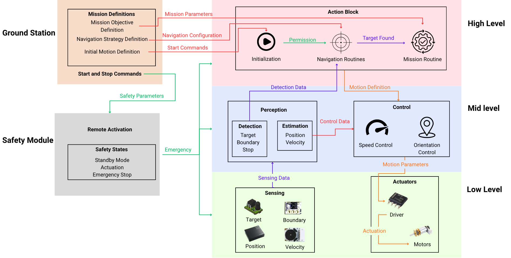
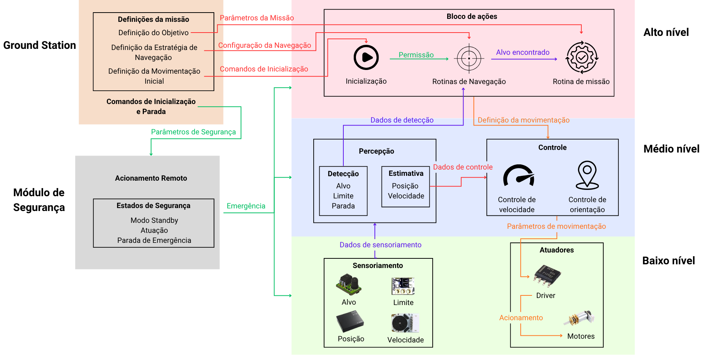

# 🧬DarwinFlow Architecture [EN]
Para a versão em Português, [clique aqui](#pt)

---

## 🔗 Project Links

- 💻 Software: [RobotLab/software/DarwinFlow](https://github.com/Bru-antunes/RobotLab/tree/main/software/DarwinFlow)  
- 📚 Documentation: [RobotLab/docs/DarwinFlow](https://github.com/Bru-antunes/RobotLab/tree/main/docs/DarwinFlow)

---

The DarwinFlow system is inspired by principles of cognitive robotics, a field that combines perception layers to enable robots to interpret their environment, handle uncertainty, and make informed decisions [Hawes et al., 2017; Krichmar, 2018]. In robotic systems, cognition refers to the computational ability to perceive, interpret, and act in environments through adaptive processes such as learning, inference, and memory integration [Langley et al., 2020; Kotseruba and Tsotsos, 2020]. Although the sumo robot operates in a controlled environment, the challenges imposed by combat dynamics, sensory limitations, and the need for fast response make it a relevant case for applying and studying these concepts.

The definition of an architecture is an element that helps ensure consistent implementation of the robot’s embedded system. A well-defined architecture establishes the logical organization of the code, delimiting functions and execution flows, which enables controlled integration between sensor reading, decision-making, and actuator control. Thus, adopting an appropriate architecture contributes to system predictability, facilitates debugging, and allows expansions or modifications without compromising software stability, acting as a computational structure responsible for organizing decision-making, behavior generation, and continuous adaptation of the robot [González-Santamarta et al., 2025].

The proposed architecture for the sumo robot, named DarwinFlow, is based on a hierarchical and modular organization structured in functional layers. This approach aims to separate responsibilities, reduce coupling between different subsystems, and allow the generalization of the architecture to other autonomous mobile robots, regardless of sensors, actuators, or the specific task performed. The architecture, shown in the figure below, is composed of three main layers: high level, mid level, and low level, supervised by a transversal safety module responsible for ensuring safe system operation, and defined by a Ground Station that acts as an external configuration interface. Information flow is bidirectional: sensory data flows upward from the low level to the high level, while commands and references flow downward from upper layers to the actuators.

**DarwinFlow Architecture. Source: RobotLab**

---

## Architecture Generalization

This architecture can be abstracted and applied to different types of systems while preserving the layered division between decision-making, control, and physical execution. This organization is valid not only for ground robots, such as line followers, exploration robots, or industrial AGVs, but also for UAVs and UUVs. In all these cases, sensors, actuators, and specific strategies change, but the hierarchical organization and information flow between layers remain essentially the same, highlighting the generality and scalability of the proposed architecture. In the table below, we can observe different types of systems that can use the proposed architecture and their respective mission objectives.

### Examples of applicable autonomous systems and their mission objectives

| Autonomous System    | Operational Context        | Objective / Mission                                                               |
| -------------------- | -------------------------- | --------------------------------------------------------------------------------- |
| Mini sumo robot      | Delimited arena            | Locate, engage, and physically push the opponent out of the valid area.           |
| Generic mobile robot | Ground environment         | Navigate autonomously, identify targets or points of interest, and perform tasks. |
| Industrial AGV       | Structured industrial site | Transport materials autonomously between predefined stations safely.              |
| UAV                  | Air environment            | Perform monitoring, inspection, or autonomous navigation missions.                |
| UUV                  | Underwater environment     | Perform inspection, exploration, or data collection in submerged environments.    |

---

## Hierarchical Layer Description

#### Ground Station

The Ground Station (or operator base station) acts as an external configuration interface, used before the start of a match to define the mission objective, navigation strategy, and general operational parameters. These include, for example, the type of strategy used to search for the target, initial movement patterns, and engagement criteria. Additionally, the Ground Station is responsible for sending start and stop commands, enabling or disabling the robot remotely. Information from this block is forwarded to the embedded system as mission parameters and navigation configurations, which directly feed the action block.

#### High Level

At the high level, the action block coordinates the overall execution flow and robot behavior. Initially, the system remains in an initialization state, where safety conditions are verified. Once operation permission is granted, the robot enters initialization routines and then navigation, responsible for executing a defined strategy. During navigation, the system continuously evaluates perception data to determine whether a target has been found. When this condition is met, a transition occurs to the mission routine, which represents the final desired behavior.

#### Mid Level

The mid level concentrates perception and control blocks, responsible for transforming raw sensor data into coherent motion commands. The perception block continuously receives sensing data from the lower level and organizes it into two main functions: detection and estimation. Detection identifies relevant mission events, such as target presence, proximity to boundaries, or conditions requiring stopping. The estimation module processes this information to infer robot states such as position and velocity, providing a more robust representation of the robot’s dynamic state. These processed estimates are then forwarded to the control block. Based on the received control data, the system computes the necessary motion parameters. Speed control ensures appropriate velocity during routines, while orientation control ensures correct alignment with the environment. These parameters are continuously adjusted based on the estimated state and high-level objectives.

#### Low Level

At the low level are the sensing and actuation blocks, responsible for direct interaction with the physical environment. The sensing block is composed of sensors dedicated to target detection, boundary identification, and acquisition of position and velocity information. These sensors provide raw data to the system, which is forwarded to the mid level for processing and decision-making. The actuator block receives motion parameters computed by the control system and converts them into physical actions. The motor driver acts as a power interface, translating control commands into electrical signals suitable for the motors, which then move the robot.

#### Safety Module

Transversally across the architecture, the safety module plays a fundamental role in system reliability. It manages safety states such as standby mode, normal operation, and emergency stop. Remote activation provides the necessary commands to transition between these states, ensuring compliance with competition rules and allowing immediate interruption in critical situations. In case of emergency, this module overrides all other levels, placing the system into a safe state.

---

# Implementation of the Proposed Architecture in the Veterano Robot

The system was implemented in the Visual Studio Code development environment using the ESP-IDF framework integrated with PlatformIO, aiming for greater control over build system configuration, debugging, and dependency management. The chosen embedded platform was the ESP32-S3 microcontroller, leveraging its parallel processing capabilities, support for advanced peripherals, and energy efficiency. Additionally, the 4D Systems gen4-ESP32-S3 (N16R8) board was used, which integrates expanded memory and graphical resources, facilitating integration with the sensing, control, and communication modules defined in the system architecture.

## Low Level

This layer contains all modules responsible for sensor reading, motor actuation, and peripheral management. The objective of this separation is to abstract *hardware* details, allowing the upper layers to use already processed information without needing to know the registers or peripherals used by the ESP32-S3. The file Motor_Task.h is responsible for controlling the drive motors. This module configures the microcontroller PWM channels, manages the rotation direction through a DRV8871 H-bridge, and converts the speed values stored in global variables into electrical signals applied to the motors. In this way, the control strategies only define the desired speed for each side of the robot, while the motor module is responsible for generating the corresponding physical signals. The *firmware* operates using a logical abstraction of a left motor and a right motor, regardless of the physical motor connections on the electronic board. The desired speeds are stored in global variables and subsequently converted into PWM signals during the motor module update. Commands range from -1023 to +1023, with positive values associated with forward motion, negative values associated with reverse motion, and zero representing a complete motor stop. The file Encoder_Task.h performs the reading of the incremental *encoders* attached to the motors. Its function is to count the pulses generated during wheel movement, allowing the determination of speed, displacement, and rotation direction. For this purpose, the ESP32-S3 internal peripheral called *Pulse Counter* was used. The obtained values are stored in global structures that can later be used by motion control algorithms. The file IMU_Task.h is responsible for communication with the LSM6DS3 inertial measurement unit through the I2C bus. This module performs the initial configuration of the accelerometer and gyroscope, periodically reads the sensor's internal registers, and converts the raw data into physical quantities that can be used by the other software layers.

The file BorderSensors_Task.h manages the digital border sensors installed on the underside of the robot. Its main function is to identify the presence of the white line that defines the combat arena boundary. In addition to reading the individual left and right sensors, the module also generates consolidated states that simplify decision-making for higher-level strategies. The border sensor values are stored in a global structure containing the individual states of the left and right sensors, as well as a consolidated state indicating whether no border was detected, only the left border was detected, only the right border was detected, or both borders were detected simultaneously. The file FOUROpponentSensors_Task.h performs the reading of the four sensors responsible for opponent detection. The module interprets the individual readings and generates logical states representing the opponent's relative position. In this way, the combat strategies do not need to directly interpret each sensor and can instead use already processed information, such as the presence of the opponent on the left, on the right, on one of the diagonals, or directly in front of the robot. The file LED_Task.h controls the status LEDs present on the electronic board. Although it does not directly participate in combat strategies, this module is used for debugging, indication of internal system states, and assistance during testing. Finally, the file pinmap.h centralizes all project *hardware* definitions. Its purpose is to centralize the association between logical functions and physical microcontroller pins, facilitating future modifications to the electronic board without requiring changes to other software modules. Table below presents the files at the low level of abstraction.

### Low-Level Layer Files and Their Functions

| File                       | Function                                                                                                                        |
| -------------------------- | ------------------------------------------------------------------------------------------------------------------------------- |
| Motor_Task.h               | Motor control through DRV8871 H-bridges, PWM signal generation, and management of motor rotation direction.                     |
| Encoder_Task.h             | Reading of incremental encoders, pulse counting, and acquisition of speed and displacement information.                         |
| IMU_Task.h                 | Communication with the LSM6DS3 IMU via I2C, configuration of the accelerometer and gyroscope, and acquisition of inertial data. |
| BorderSensors_Task.h       | Reading of border sensors and generation of logical states related to the detection of the arena boundary line.                 |
| FOUROpponentSensors_Task.h | Reading of opponent detection sensors and generation of relative opponent positioning states.                                   |
| LED_Task.h                 | Control of status LEDs used for debugging, state indication, and system testing.                                                |
| pinmap.h                   | Centralization of the physical microcontroller pin mapping and association between hardware and logical functions.              |

## Mid Level

The mid-level layer is responsible for organizing the information obtained from physical devices and creating abstractions that will be used by the combat strategies. This layer contains the elements responsible for data sharing and overall system configuration. The file globalVariables.h constitutes the main communication mechanism between the *firmware* modules. It stores the structures containing information from sensors, motors, *encoders*, IMU, LEDs, and the robot's general states. This approach allows different modules to share information in an organized and standardized manner. The file config.h gathers all project configurations in a single location. This file defines compilation parameters, feature enablement, operating frequencies, sensor and motor inversions, as well as other options related to *hardware* configuration. The use of this file allows the *firmware* to be quickly adapted to different versions of the robot without requiring extensive code modifications. The module also defines global variables responsible for the overall system state, including the robot's current operating mode, information about active strategies, and parameters used by the control routines. In this way, the mid-level layer acts as an interface between the physical devices and the decision-making algorithms.

At the intermediate level of the architecture, in addition to the routines already implemented, there is room for the incorporation of more advanced processing and decision-making algorithms. This layer acts as an interface between the raw data provided by the sensors and the high-level strategies, being responsible for transforming elementary information into variables that are more useful for robot control. One of the intended applications for this layer is the implementation of motion control algorithms. Based on data from the *encoders* and the IMU, speed and position controllers, such as PID controllers, can be developed to compensate for mechanical differences between the motors and improve the accuracy of maneuvers performed during combat. This approach allows the movements defined by the strategies to be executed in a more consistent and repeatable manner. Another functionality that can be incorporated is sensor fusion. In this context, information from different sensors can be combined to obtain more reliable estimates of the robot's state. Data from the accelerometer, gyroscope, and *encoders* can be used together to estimate orientation, angular velocity, and displacement, reducing the individual limitations of each sensor and increasing system robustness. Digital filtering algorithms can also be implemented to reduce noise from sensor readings. The table below presents the files at the mid level of abstraction.

### Mid-Level Layer Files and Their Functions

| File              | Function                                                                                                           |
| ----------------- | ------------------------------------------------------------------------------------------------------------------ |
| globalVariables.h | Storage of global structures shared between sensors, actuators, strategies, and system modules.                    |
| config.h          | Definition of the project's general configurations, module enablement, operating parameters, and hardware options. |

## High Level

The high-level layer concentrates the algorithms responsible for the robot's behavior during competition. In this layer, the navigation, search, attack, and border strategies are implemented, using exclusively the abstractions provided by the lower layers. The file Strategy_Init_7.h implements the initialization routine used at the beginning of the match. This strategy executes a pre-programmed sequence of movements that positions the robot in the arena before the start of the search and attack actions. The file Strategy_Search_Forward.h is responsible for the search strategy. While no opponent is detected by the sensors, the robot continues moving forward in a straight line across the arena. When a valid detection occurs, the system transitions to attack mode. The file Strategy_Attack_DoubleFront.h implements the robot's main offensive strategy. This module uses the states provided by the opponent sensors to determine the target direction and adjust the robot's movement. Depending on the detected position, the system may perform turns, diagonal movements, or frontal attacks at maximum speed. The algorithm also incorporates a boost routine intended to increase pushing force during prolonged frontal contact situations. The file Strategy_Border_180.h implements the defensive border recovery strategy. Whenever a border sensor identifies the arena boundary line, this strategy takes control of the robot, executing a reverse maneuver followed by an approximate 180-degree rotation before returning to search mode.

It is important to highlight that the strategies presented in this work represent only an initial implementation of the robot's behaviors. The developed architecture was designed to allow the inclusion of new strategies in a simple and modular manner, enabling the continuous evolution of the system as new tests, competitions, and performance analyses are conducted. Thus, each robot operating mode, such as initialization, search, attack, and border, may have multiple associated strategies, each suitable for different combat scenarios. To enable this expansion, the Select_strategy.h module was developed, responsible for selecting the strategies used by the robot in each operating mode. Instead of directly associating a single strategy with each state of the main state machine, the system uses this module as an intermediate management layer, allowing different implementations to be selected without modifications to the central *firmware* logic. In addition to simplifying code maintenance, this approach makes it possible to implement a *Ground Station* for robot configuration. In this context, the Select_strategy.h module acts as the interface between the embedded *firmware* and the external configuration software. The table below presents the files at the high level of abstraction.

### High-Level Layer Files and Their Functions

| File                          | Function                                                                                                                                    |
| ----------------------------- | ------------------------------------------------------------------------------------------------------------------------------------------- |
| Strategy_Init_7.h             | Implementation of the initialization routine responsible for the robot's initial movement after the start of the match.                     |
| Strategy_Search_Forward.h     | Search strategy responsible for the robot's movement while no opponent is detected.                                                         |
| Strategy_Attack_DoubleFront.h | Offensive strategy based on the opponent's position detected by the opponent sensors.                                                       |
| Strategy_Border_180.h         | Border recovery strategy responsible for moving the robot away from the arena boundary line.                                                |
| Select_Strategy.h             | Management and selection of the strategies used in each robot operating mode, enabling future expansion of the available set of strategies. |

## Ground Station and Safety Module

The Ground Station corresponds to tools used for monitoring, configuration, and debugging during development. Through ESP32-S3 serial communication, it enables real-time monitoring of sensor readings, internal states, IMU data, encoder counts, and strategy states. It also supports future JSON-based configuration interfaces.

The safety module ensures safe robot operation during testing and competition. It is implemented through MAR_Task.h, managing READY, START, and STOP states. When in READY or STOP, motors remain disabled and no strategy is executed. The table below presents the files at the Safety Module and Ground Station abstraction level.

### Ground Station and Safety Module Layer Files and Their Functions

| File/Module                     | Function                                                                                                                                                                                 |
| ------------------------------- | ---------------------------------------------------------------------------------------------------------------------------------------------------------------------------------------- |
| Ground Station (to be implemented) | External interface intended for robot configuration, strategy selection, parameter adjustment, and real-time monitoring of variables without requiring firmware recompilation.           |
| MAR_Task.h / Safety Module      | Implementation of the remote activation module, responsible for the READY, START, and STOP states, as well as motor interlocking.                                                       |

---
   

# 🧬Arquitetura DarwinFlow [PT]

---
## 🔗 Links do Projeto

- 💻 Software: [RobotLab/software/DarwinFlow](https://github.com/Bru-antunes/RobotLab/tree/main/software/DarwinFlow)   
- 📚 Documentação: [RobotLab/docs/DarwinFlow](https://github.com/Bru-antunes/RobotLab/tree/main/docs/DarwinFlow)

---

O sistema DarwinFlow é inspirado em princípios da robótica cognitiva, área que combina camada de percepção para permitir que robôs interpretem o ambiente, lidem com incertezas e tomem decisões informadas [Hawes et al.,2017; Krichmar, 2018]. Em sistemas robóticos, a cognição refere-se à capacidade computacional de perceber, interpretar e agir em ambientes por meio de processos adaptativos, como aprendizado, inferência e integração de memória [Langley et al., 2020; Kotseruba and Tsotsos, 2020]. Embora o robô de sumô opere em um ambiente controlado, os desafios impostos pela dinâmica do combate, pela limitação sensorial e pela necessidade de resposta rápida tornam-no um caso relevante para a aplicação e estudo desses conceitos.

A definição de uma arquitetura é um elemento que auxilia a implementação consistente do sistema embarcado do robô. Uma arquitetura bem definida estabelece a organização lógica do código, delimitando funções e fluxos de execução, o que permite a integração controlada entre a leitura de sensores, a tomada de decisão e o acionamento dos atuadores. Dessa forma, a adoção de uma arquitetura adequada contribui para a previsibilidade do sistema, facilita a depuração e possibilita expansões ou modificações sem comprometer a estabilidade do software, atuando como uma estrutura computacional responsável por organizar a tomada de decisão, a geração de comportamentos e a adaptação contínua do robô [González-Santamarta et al.,2025].

A arquitetura proposta para o robô de sumô, denominada DarwinFlow, baseia-se em uma organização hierárquica e modular, estruturada em camadas funcionais. Essa abordagem visa separar responsabilidades, reduzir o acoplamento entre os diferentes subsistemas e permitir a generalização da arquitetura para outros robôs móveis autônomos, independentemente de sensores, atuadores ou da tarefa específica executada. A arquitetura, descrita na Figura abaixo, é composta por três camadas principais: alto nível, médio nível e baixo nível, supervisionadas por um módulo transversal de segurança, responsável por garantir a operação segura do sistema, e definidas por uma *Ground Station*, que atua como interface externa de configuração. O fluxo de informações ocorre de forma bidirecional: dados sensoriais sobem da camada de baixo nível até o alto nível, enquanto comandos e referências descem das camadas superiores até os atuadores.

**Arquitetura DarwinFlow. Fonte: RobotLab**

## Generalização da arquitetura

Essa arquitetura pode ser abstraída e aplicada a diferentes tipos de sistemas ao preservar a divisão em camadas entre decisão, controle e execução física. Essa organização é válida não apenas para robôs terrestres, como seguidores de linha, robôs de exploração ou para um AGV industrial, mas também para um UAV e um UUV. Em todos esses casos, alteram-se os sensores, atuadores e estratégias específicas, mas a organização hierárquica e o fluxo de informações entre camadas permanecem essencialmente os mesmos, evidenciando a generalidade e a escalabilidade da arquitetura proposta. Na Tabela abaixo, podemos observar os diferentes tipos de sistemas que podem utilizar a arquitetura proposta e suas respectivas missões. 

### Exemplos de sistemas autônomos aplicáveis e seus objetivos de missão

| Sistema Autônomo    | Contexto Operacional            | Objetivo / Missão                                                                                  |
| ------------------- | ------------------------------- | -------------------------------------------------------------------------------------------------- |
| Robô de mini sumô   | Arena delimitada                | Localizar, engajar e deslocar fisicamente o oponente para fora da área válida.                     |
| Robô móvel genérico | Ambiente terrestre              | Navegar de forma autônoma, identificar alvos ou pontos de interesse e executar tarefas locais.     |
| AGV industrial      | Ambiente industrial estruturado | Realizar transporte autônomo de materiais entre estações pré-definidas com segurança.              |
| UAV                 | Ambiente aéreo                  | Executar missões de monitoramento, inspeção ou navegação autônoma com base em objetivos definidos. |
| UUV                 | Ambiente subaquático            | Realizar inspeção, exploração ou coleta de dados em ambientes submersos.                           |

---

## Descrição das Camadas Hierárquicas 

#### Ground Station

A *Ground Station* (ou estação base do operador) atua como interface externa de configuração, sendo utilizada antes do início da partida para definir o objetivo da missão, a estratégia de navegação e os parâmetros gerais de operação. Esses dados incluem, por exemplo, o tipo de estratégia a ser adotada na busca do alvo, os padrões iniciais de movimento e os critérios de engajamento. Além disso, a *Ground Station* é responsável pelo envio dos comandos de inicialização e parada, que habilitam ou inibem o funcionamento do robô de forma remota. As informações provenientes desse bloco são encaminhadas ao sistema embarcado na forma de parâmetros da missão e configurações de navegação, que alimentam diretamente o bloco de ações.

#### Alto nível

No alto nível, o bloco de ações coordena o fluxo geral de execução e o comportamento global do robô. Inicialmente, o sistema permanece em um estado de inicialização, no qual são verificados os estados de segurança. Uma vez concedida a permissão de operação, o robô passa para as rotinas de inicialização e, em seguida, navegação, responsáveis por executar uma estratégia definida. Durante a etapa de navegação, o sistema avalia continuamente as informações de percepção para determinar se um alvo foi encontrado. Quando essa condição é satisfeita, ocorre a transição para a rotina de missão, que representa o comportamento final desejado.

#### Médio nível

O nível médio concentra os blocos de percepção e controle, responsáveis por transformar dados brutos de sensores em comandos coerentes de movimentação. O bloco de percepção recebe continuamente os dados de sensoriamento provenientes do nível inferior e os organiza em duas funções principais: detecção e estimativa. A detecção é responsável por identificar eventos relevantes para a missão, como a presença do alvo, a aproximação dos limites de atuação ou condições que exigem parada. Já o módulo de estimativa processa essas informações para inferir estados do robô, como posição e velocidade, fornecendo uma representação mais robusta do estado dinâmico do robô. As informações processadas pela estimativa são então encaminhadas ao bloco de controle. A partir dos dados de controle recebidos, o sistema calcula os parâmetros de movimentação necessários. O controle de velocidade garante que o robô aplique a velocidade adequada durante as rotinas, enquanto o controle de orientação assegura o alinhamento correto em relação ao ambiente. Esses parâmetros são ajustados continuamente em função do estado estimado e dos objetivos definidos no nível superior.

#### Baixo nível

No baixo nível, localizam-se os blocos de sensoriamento e atuação, responsáveis pela interação direta com o ambiente físico. O bloco de sensoriamento é composto por sensores dedicados à detecção do alvo, à identificação dos limites de atuação e à obtenção de informações de posição e velocidade. Esses sensores fornecem dados brutos ao sistema, que são encaminhados ao nível médio para processamento e tomada de decisão. Já o bloco de atuadores recebe os parâmetros de movimentação calculados pelo controle e os converte em ações físicas. O driver de motores atua como interface de potência, traduzindo os comandos de controle em sinais elétricos adequados para os motores, que, por sua vez, realizam o deslocamento do robô.

#### Módulo de segurança

De forma transversal à arquitetura, o módulo de segurança desempenha um papel fundamental na confiabilidade do sistema. Ele gerencia os estados de segurança, como modo *standby*, atuação normal e parada de emergência. O acionamento remoto fornece os comandos necessários para transitar entre esses estados, garantindo conformidade com as regras de competição e permitindo uma interrupção imediata do funcionamento em situações críticas. Em caso de emergência, esse módulo sobrepõe-se aos demais níveis, colocando o sistema em um estado seguro.

---

# Implementação da arquitetura proposta no robô Veterano

O sistema foi implementado no ambiente de desenvolvimento Visual Studio Code, utilizando o *framework* ESP-IDF integrado ao PlatformIO, visando maior controle sobre a configuração do build system, depuração e gerenciamento de dependências. A plataforma embarcada escolhida foi o microcontrolador ESP32-S3, explorando suas capacidades de processamento paralelo, suporte a periféricos avançados e eficiência energética. Além disso, foi utilizada a placa 4D Systems gen4-ESP32-S3 (N16R8), que integra memória expandida e recursos gráficos, facilitando a integração com os módulos de sensoriamento, controle e comunicação definidos na arquitetura do sistema.

## Baixo nível

Nessa camada encontram-se todos os módulos que realizam leitura de sensores, acionamento de motores e gerenciamento de periféricos. O objetivo dessa separação é abstrair os detalhes de *hardware*, permitindo que as camadas superiores utilizem informações já processadas sem necessidade de conhecer os registradores ou periféricos utilizados pelo ESP32-S3. O arquivo Motor\_Task.h é responsável pelo controle dos motores de tração. Esse módulo configura os canais de PWM do microcontrolador, realiza o gerenciamento da direção de rotação através da ponte H do tipo DRV8871 e converte os valores de velocidade armazenados nas variáveis globais em sinais elétricos aplicados aos motores. Dessa forma, as estratégias de controle apenas definem a velocidade desejada para cada lado do robô, enquanto o módulo de motores se encarrega da geração dos sinais físicos correspondentes. O *firmware* trabalha com uma abstração lógica de motor esquerdo e motor direito, independentemente da ligação física dos motores na placa eletrônica. As velocidades desejadas são armazenadas em variáveis globais e posteriormente convertidas em sinais de PWM durante a atualização do módulo de motores. Os comandos variam de -1023 a +1023, sendo valores positivos associados ao movimento para frente, valores negativos ao movimento para trás e o valor zero à parada completa do motor. O arquivo Encoder\_Task.h realiza a leitura dos *encoders* incrementais acoplados aos motores. Sua função é contabilizar os pulsos gerados durante a movimentação das rodas, permitindo determinar velocidade, deslocamento e sentido de rotação. Para isso, foi utilizado o periférico interno do ESP32-S3, denominado *Pulse Counter*. Os valores obtidos são armazenados em estruturas globais que podem ser utilizadas posteriormente por algoritmos de controle de movimento. O arquivo IMU\_Task.h é responsável pela comunicação com a unidade de medição inercial LSM6DS3 através do barramento I2C. Esse módulo realiza a configuração inicial do acelerômetro e do giroscópio, efetua a leitura periódica dos registradores internos do sensor e converte os dados brutos em grandezas físicas utilizáveis pelas demais camadas do software. 

O arquivo BorderSensors\_Task.h gerencia os sensores digitais de borda instalados na parte inferior do robô. Sua principal função é identificar a presença da linha branca que delimita a arena de combate. Além da leitura individual dos sensores esquerdo e direito, o módulo também gera estados consolidados que simplificam a tomada de decisão das estratégias superiores. Os valores dos sensores de borda lidos são armazenados em uma estrutura global contendo os estados individuais dos sensores esquerdo e direito, além de um estado consolidado que informa se nenhuma borda foi detectada, se apenas a borda esquerda foi detectada, se apenas a borda direita foi detectada ou se ambas foram detectadas simultaneamente. O arquivo FOUROpponentSensors\_Task.h realiza a leitura dos quatro sensores responsáveis pela detecção do adversário. O módulo interpreta as leituras individuais e gera estados lógicos que representam a posição relativa do oponente. Dessa forma, as estratégias de combate não precisam interpretar diretamente cada sensor, podendo utilizar informações já processadas, como presença do adversário à esquerda, à direita, em uma das diagonais ou diretamente à frente do robô. O arquivo LED\_Task.h controla os LEDs de sinalização presentes na placa eletrônica. Embora não participe diretamente das estratégias de combate, esse módulo é utilizado para depuração, indicação de estados internos do sistema e auxílio durante testes. Por fim, o arquivo pinmap.h concentra todas as definições de *hardware* do projeto. Seu objetivo é centralizar a associação entre funções lógicas e pinos físicos do microcontrolador, facilitando alterações futuras na placa eletrônica sem a necessidade de modificar outros módulos do software. A Tabela \ref{tab:baixo_nivel} indica os arquivos no baixo nível de abstração. 

### Arquivos da camada de baixo nível e suas funções

| Arquivo                    | Função                                                                                                                          |
| -------------------------- | ------------------------------------------------------------------------------------------------------------------------------- |
| Motor_Task.h               | Controle dos motores através das pontes H DRV8871, geração dos sinais de PWM e gerenciamento do sentido de rotação dos motores. |
| Encoder_Task.h             | Leitura dos encoders incrementais, contabilização de pulsos e obtenção de informações de velocidade e deslocamento.             |
| IMU_Task.h                 | Comunicação com a IMU LSM6DS3 via I2C, configuração do acelerômetro e giroscópio e leitura dos dados inerciais.                 |
| BorderSensors_Task.h       | Leitura dos sensores de borda e geração dos estados lógicos relacionados à detecção da linha limite da arena.                   |
| FOUROpponentSensors_Task.h | Leitura dos sensores de detecção de adversário e geração dos estados de posicionamento relativo do oponente.                    |
| LED_Task.h                 | Controle dos LEDs de sinalização utilizados para depuração, indicação de estados e testes do sistema.                           |
| pinmap.h                   | Centralização do mapeamento físico dos pinos do microcontrolador e associação entre hardware e funções lógicas.                 |

## Médio nível

A camada de médio nível é responsável pela organização das informações obtidas pelos dispositivos físicos e pela criação de abstrações que serão utilizadas pelas estratégias de combate. Nessa camada encontram-se os elementos responsáveis pelo compartilhamento de dados e pela configuração geral do sistema. O arquivo globalVariables.h constitui o principal mecanismo de comunicação entre os módulos do *firmware*. Nele são armazenadas as estruturas contendo informações dos sensores, motores, *encoders*, IMU, LEDs e estados gerais do robô. Essa abordagem permite que diferentes módulos compartilhem informações de forma organizada e padronizada. O arquivo config.h reúne todas as configurações do projeto em um único local. Nesse arquivo são definidos parâmetros de compilação, habilitação de recursos, frequências de operação, inversões de sensores e motores, além de outras opções relacionadas à configuração do *hardware*. A utilização desse arquivo permite adaptar rapidamente o *firmware* para diferentes versões do robô sem necessidade de alterações extensas no código. O módulo também define variáveis globais responsáveis pelo estado geral do sistema, incluindo o modo atual de operação do robô, informações sobre estratégias ativas e parâmetros utilizados pelas rotinas de controle. Dessa forma, a camada de médio nível atua como uma interface entre os dispositivos físicos e os algoritmos de tomada de decisão.

No nível intermediário da arquitetura, além das rotinas já implementadas, existe espaço para a incorporação de algoritmos mais avançados de processamento e tomada de decisão. Essa camada atua como uma interface entre os dados brutos fornecidos pelos sensores e as estratégias de alto nível, sendo responsável por transformar informações elementares em variáveis mais úteis para o controle do robô. Uma das aplicações previstas para essa camada é a implementação de algoritmos de controle de movimento. A partir dos dados dos *encoders* e da IMU, podem ser desenvolvidos controladores de velocidade e posição, como controladores PID, capazes de compensar diferenças mecânicas entre os motores e melhorar a precisão das manobras realizadas durante o combate. Essa abordagem permite que os movimentos definidos pelas estratégias sejam executados de forma mais consistente e repetível. Outra funcionalidade que pode ser incorporada é a fusão sensorial. Nesse contexto, informações provenientes de diferentes sensores podem ser combinadas para obter estimativas mais confiáveis do estado do robô. Os dados do acelerômetro, giroscópio e \textit{encoders} podem ser utilizados em conjunto para estimar orientação, velocidade angular e deslocamento, reduzindo limitações individuais de cada sensor e aumentando a robustez do sistema. Também podem ser implementados algoritmos de filtragem digital para redução de ruídos provenientes das leituras dos sensores. A Tabela abaixo indica os arquivos no médio nível de abstração. 

### Arquivos da camada de médio nível e suas funções

| Arquivo           | Função                                                                                                              |
| ----------------- | ------------------------------------------------------------------------------------------------------------------- |
| globalVariables.h | Armazenamento das estruturas globais compartilhadas entre sensores, atuadores, estratégias e módulos do sistema.    |
| config.h          | Definição das configurações gerais do projeto, habilitação de módulos, parâmetros de operação e opções de hardware. |

## Alto nível

A camada de alto nível concentra os algoritmos responsáveis pelo comportamento do robô durante a competição. Nessa camada são implementadas as estratégias de navegação, busca, ataque e bordas, utilizando exclusivamente as abstrações fornecidas pelas camadas inferiores. O arquivo Strategy\_Init\_7.h implementa a rotina de inicialização utilizada no início da luta. Essa estratégia executa uma sequência pré-programada de movimentos que posiciona o robô na arena antes do início das ações de busca e ataque. O arquivo Strategy\_Search\_Forward.h é responsável pela estratégia de busca. Enquanto nenhum adversário é detectado pelos sensores, o robô permanece avançando em linha reta pela arena. Quando ocorre uma detecção válida, o sistema realiza a transição para o modo de ataque. O arquivo Strategy\_Attack\_DoubleFront.h implementa a principal estratégia ofensiva do robô. Esse módulo utiliza os estados fornecidos pelos sensores de oponente para determinar a direção do alvo e ajustar a movimentação do robô. Dependendo da posição detectada, o sistema pode realizar curvas, deslocamentos diagonais ou ataques frontais em velocidade máxima. O algoritmo também incorpora uma rotina de impulso destinada a aumentar a força de empurrão em situações de contato frontal prolongado. O arquivo Strategy\_Border\_180.h implementa a estratégia defensiva de recuperação de borda. Sempre que um sensor de borda identifica a linha limite da arena, essa estratégia assume o controle do robô, executando uma sequência de recuo seguida por uma rotação aproximada de 180 graus antes de retornar ao modo de busca.

Cabe destacar que as estratégias apresentadas neste trabalho representam apenas uma implementação inicial dos comportamentos do robô. A arquitetura desenvolvida foi projetada para permitir a inclusão de novas estratégias de forma simples e modular, possibilitando a evolução contínua do sistema conforme novos testes, competições e análises de desempenho sejam realizados. Dessa forma, cada modo de operação do robô, como inicialização, busca, ataque e borda, pode possuir múltiplas estratégias associadas, cada uma adequada a diferentes cenários de combate. Para viabilizar essa expansão, foi desenvolvido o módulo Select\_strategy.h, responsável por realizar a seleção das estratégias utilizadas pelo robô em cada modo de operação. Em vez de associar diretamente uma única estratégia a cada estado da máquina de estados principal, o sistema utiliza esse módulo como uma camada intermediária de gerenciamento, permitindo que diferentes implementações sejam escolhidas sem alterações na lógica central do *firmware*. Além de simplificar a manutenção do código, essa abordagem torna possível a implementação de uma *Ground Station* para configuração do robô. Nesse contexto, o módulo Select\_strategy.h atua como a interface entre o *firmware* embarcado e o software externo de configuração. A Tabela abaixo indica os arquivos no alto nível de abstração. 

### Arquivos da camada de alto nível e suas funções

| Arquivo                       | Função                                                                                                                                                    |
| ----------------------------- | --------------------------------------------------------------------------------------------------------------------------------------------------------- |
| Strategy_Init_7.h             | Implementação da rotina de inicialização responsável pela movimentação inicial do robô após o início da luta.                                             |
| Strategy_Search_Forward.h     | Estratégia de busca responsável pela movimentação do robô enquanto nenhum adversário é detectado.                                                         |
| Strategy_Attack_DoubleFront.h | Estratégia ofensiva baseada na posição do adversário detectada pelos sensores de oponente.                                                                |
| Strategy_Border_180.h         | Estratégia de recuperação de borda responsável por afastar o robô da linha limite da arena.                                                               |
| Select_Strategy.h             | Gerenciamento e seleção das estratégias utilizadas em cada modo de operação do robô, permitindo a expansão futura do conjunto de estratégias disponíveis. |

## Ground Station e Módulo de Segurança

A *Ground Station* corresponde ao conjunto de ferramentas utilizadas para monitoramento, configuração e depuração do robô durante seu desenvolvimento. Por meio da comunicação serial disponibilizada pelo ESP32-S3, é possível implementar interfaces para acompanhamento em tempo real as leituras dos sensores, estados internos do sistema, informações da IMU, contagem dos *encoders* e realizar mudanças de estado das estratégias. Essas informações auxiliam na identificação de falhas, ajuste de parâmetros e validação dos algoritmos implementados. A arquitetura adotada também possibilita a futura implementação de uma interface baseada em arquivos JSON, permitindo selecionar estratégias de combate, ajustar parâmetros de movimentação e configurar sensores sem necessidade de modificar diretamente o código-fonte. Essa abordagem aumenta a flexibilidade operacional do robô e reduz o tempo necessário para ajustes entre diferentes rodadas da competição.

O módulo de segurança foi desenvolvido para garantir o funcionamento seguro do robô durante testes e competições. Sua principal função é impedir movimentações indesejadas e assegurar que o sistema responda adequadamente aos comandos de início e parada. Essa funcionalidade é implementada através do arquivo MAR\_Task.h, responsável pelo gerenciamento do sistema MAR. O módulo opera em três estados principais: pronto, iniciado e parado. Enquanto o sistema permanece nos estados de pronto ou parado, os motores permanecem desabilitados e nenhuma estratégia é executada. A Tabela abaixo indica os arquivos no nível de abstração do módulo de segurança e da *Ground Station*. 

### Arquivos da camada de Ground Station e Módulo de Segurança e suas funções

| Arquivo/Módulo                 | Função                                                                                                                                                                                |
| ------------------------------ | ------------------------------------------------------------------------------------------------------------------------------------------------------------------------------------- |
| Ground Station (a implementar) | Interface externa destinada à configuração do robô, seleção de estratégias, ajuste de parâmetros e monitoramento de variáveis em tempo real sem necessidade de recompilar o firmware. |
| MAR_Task.h / Módulo de Segurança| Implementação do módulo de ativação remota, responsável pelos estados READY, START e STOP e pelo intertravamento dos motores.                                                         |
