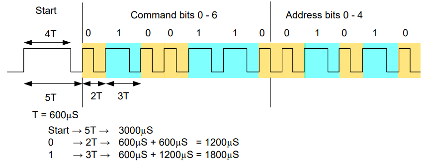
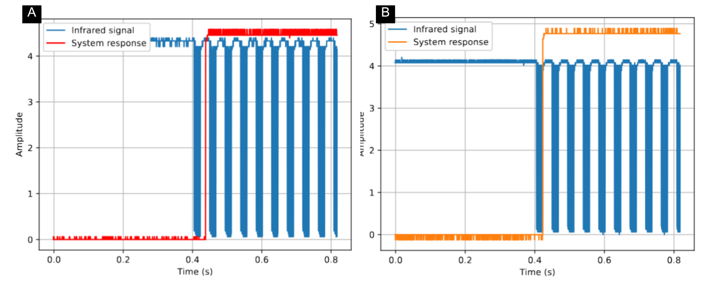

# MAR – Remote Activation Module [EN]
Para a versão em Português, [clique aqui](#pt)

---

## 📚 Reference, Motivation and Adaptation

This project is based on:

> **Antunes et al. (2025)** – *Development of a Low-Cost Remote Activation System for Competitive Sumo Robots*
> Available at: https://www.sba.org.br/open_journal_systems/index.php/sbai/article/view/5371

The original work presents a low-cost remote activation system for sumo robots using infrared communication based on the SIRC protocol at 38 kHz. Its main motivation is to ensure reliable, standardized, and interference-resistant activation during competitions.

**When referring to this project, please cite the paper above.**

Based on this work, the present project introduces adaptations focused on **modularity, ease of use, and hardware simplification**, aiming to create a portable and easily replicable solution.

Main adaptations:

* Modular hardware design
* Migration to ATTINY13A (size and cost reduction)
* Firmware rewritten from ATMEGA328P
* Timer and interrupt reconfiguration
* Falling-edge-only signal processing
* Noise filtering via timing constraints
* Full automation via scripts

---

## 🔗 Project Links

- 💻 Software: [RobotLab/software/MAR](https://github.com/Bru-antunes/RobotLab/tree/main/software/MAR)  
- 🔧 Hardware: [RobotLab/hardware/MAR](https://github.com/Bru-antunes/RobotLab/tree/main/hardware/MAR)
- 📚 Documentation: [RobotLab/docs/MAR](https://github.com/Bru-antunes/RobotLab/tree/main/docs/MAR)

## 1. Context

In sumo robot competitions, the use of remote activation systems is often standardized by the rules, with a common requirement for infrared communication operating at 38 kHz using the SIRC protocol. This standardization primarily aims to ensure fairness among competitors, reliability in robot activation, and immunity to external interference. The 38 kHz modulation allows commercial infrared receivers to filter noise from ambient light sources and other infrared radiation. The SIRC protocol stands out in this context due to its simplicity, robustness, and wide availability of compatible components. Its mandatory use in competitions requires embedded systems to implement mechanisms for generating and decoding time-based signals, respecting both the modulation frequency and the pulse structure that encodes information. In this scenario, developing compact, low-cost, and easily integrable solutions becomes a relevant challenge in competitive robotics.

## 2. SIRC-based remote activation system

The work presented by Antunes et al. (2025) describes the development of a low-cost remote activation system for sumo robots using infrared communication based on the SIRC protocol. The main motivation is the need for an accessible, standardized, and reliable solution for robot activation in competitions, replacing more expensive commercial alternatives. The proposed system consists of an infrared transmitter and an onboard receiver installed on the robot, responsible for interpreting received commands and triggering system activation at the appropriate moment.

### 2.1 SIRC protocol operation

The SIRC protocol is based on the time-encoding of infrared signals, where information is represented by pulse duration rather than fixed voltage levels. Each transmission begins with a start bit, characterized by a longer pulse used for synchronization. This is followed by a sequence of data bits, where binary values are distinguished solely by timing: a logic ‘1’ is represented by a longer interval, while a logic ‘0’ corresponds to a shorter one. This approach requires the receiver to accurately measure time intervals between signal transitions, making timers and interrupts essential for correct decoding.

**SIRC protocol Workflow**

### 2.2 Decoding logic

In Antunes et al. (2025), signal reception is performed by detecting signal edges combined with time interval measurement. From this, the transmitted bit sequence can be reconstructed. The decoding logic starts with the detection of the start bit, which serves as a synchronization reference. Once this initial event is identified, the system proceeds with sequential bit reading based on measured timing intervals. After the full data packet is received, a validation step is performed before executing the corresponding action, improving system reliability. The authors also account for noise and signal variations by introducing tolerance margins in timing measurements, ensuring robustness in environments with electromagnetic interference or lighting fluctuations.

## 3. Adaptation to the ATTINY13A microcontroller

In this work, the original approach was adapted to facilitate implementation in modular boards, reducing system size and improving integration across different robotic platforms. To achieve this, the system was miniaturized using the ATTINY13A microcontroller. This required several modifications compared to the original code developed in C for the ATMEGA328P.

### 3.1 Architecture and timing adjustments

One of the main changes involved register replacement due to architectural differences between the microcontrollers. Additionally, timers had to be reconfigured to match the hardware limitations of the ATTINY13A. These adjustments were essential to preserve the timing behavior required for correct SIRC decoding despite the reduced hardware resources.

### 3.2 Interrupt system modification

Another relevant modification involved the interrupt system. While the original implementation used only falling-edge detection, the ATTINY13A allows both rising and falling edge detection. To preserve the original system logic, software filtering was implemented to consider only falling edges. This maintained compatibility with the original design while leveraging the flexibility of the new microcontroller. Additionally, robustness improvements were introduced by defining stricter timing ranges for identifying start, 0, and 1 bits. Values outside these ranges are discarded, significantly reducing noise sensitivity.

## 4. Hardware design

The system was implemented on a compact PCB with dimensions 15mm by 14mm, aiming to facilitate integration into different sumo robot platforms. The circuit includes two indicator LEDs (blue and red), used to visually signal system states during operation, enabling quick status identification during testing and competitions. From an electronic standpoint, the design includes a pull-up resistor on the microcontroller reset pin to ensure stable operation, as well as current-limiting resistors for the LEDs. The infrared receiver used is the TSOP4838, which includes internal filtering and demodulation stages optimized for 38 kHz signals. It also features automatic gain control (AGC), increasing robustness under varying lighting conditions. Unlike simpler sensors such as the TSSP, the TSOP provides better immunity to continuous infrared noise, such as interference from opponent sensors. Additionally, a decoupling capacitor was placed near the microcontroller to stabilize power supply. The receiver circuit also follows manufacturer recommendations, using an additional resistor-capacitor network to reduce power line noise and improve signal reliability. For more information on hardware design and gerber, access [RobotLab/software/MAR](https://github.com/Bru-antunes/RobotLab/tree/main/software/MAR).

## 5. Cost and Performance

For the MAR, the obtained results highlight the advantages of the proposed approach in comparison with both the commercial solution and the system described in Antunes et al. (2025). From an economic perspective, a significant reduction in the implementation cost of the developed module was observed. While the analyzed commercial solution has an estimated cost of USD 6.95, the system described in the reference article has a cost of USD 5.18. In contrast, the solution proposed in this work, based on a modular architecture and low-cost components, achieves a total cost of only USD 1.1511, with the costs detailed in the table below, excluding shipping and labor costs. This substantial reduction reinforces the impact of system miniaturization and the selection of electronic and structural components, enabling the development of an affordable solution for competitive robotics applications.

| Description          | Value (USD) |
|---------------------|------------:|
| PCB                 | 0.3267 |
| 100 nF Capacitor    | 0.0047 |
| 4.7 μF Capacitor    | 0.0147 |
| Red LED             | 0.0132 |
| Blue LED            | 0.0132 |
| 220 Ω Resistor      | 0.0053 |
| 220 Ω Resistor      | 0.0053 |
| 7.5 kΩ Resistor     | 0.0053 |
| 100 Ω Resistor      | 0.0053 |
| TSOP4838            | 0.3920 |
| Pin Header Connector| 0.0052 |
| ATTINY13A           | 0.6300 |
| **TOTAL**           | **1.1511** |

In addition to the cost reduction, the results also demonstrate an improvement in the temporal performance of the remote activation system. Similarly to what was observed in the reference work, the proposed module maintains superiority over the analyzed commercial solution. While the commercial system presents a response time of approximately 33 ms, the module developed in this work achieves a response time of 18 ms, evidencing a significant improvement in actuation latency. This performance is particularly relevant in sumo robotics applications, where reduced response times directly impact the competitiveness and reliability of the starting system. Figure A presents the average response time of the commercial solution system to the infrared signal, while Figure B presents the average response time of the system developed in this work.

**Response time: A) Comercial module; B) MAR**

## 6. ATTINY13A programming process

The ATTINY13A setup required specific configuration and programming steps. Initially, the Arduino Uno was configured as an ISP programmer by flashing the ArduinoISP firmware using the Arduino IDE. This allows it to act as a bridge for programming the microcontroller. For in-circuit programming, a programming clip compatible with the ATTINY13A package was used, allowing direct access to the chip without desoldering. The fuse bits were also configured, disabling the default clock division by 8, enabling operation at 9.6 MHz. Firmware development was performed in VSCode using avr-gcc. Uploading to the microcontroller was done using avrdude via terminal commands, providing full control over the build and flashing process. These adaptations preserved the functionality proposed by Antunes et al. (2025) while significantly reducing system size and complexity.

## 7. Development automation tools

To improve accessibility and reproducibility, two software tools were developed: MAR_setup and MAR_programmer. These tools automate critical steps in the development workflow, reducing manual configuration requirements. For more information on automation tools, access [RobotLab/software/MAR](https://github.com/Bru-antunes/RobotLab/tree/main/software/MAR).

### 7.1 MAR_setup

MAR_setup automates the environment setup required for development. It is compatible with both Windows and Linux systems, adapting its behavior accordingly. On Windows, it downloads essential tools such as avr-gcc and avrdude from official sources, organizes project directories, and configures environment variables automatically. On Linux, installation is simplified through the system package manager, automatically installing required dependencies. This eliminates manual setup steps and ensures consistency across different development environments.

### 7.2 MAR_programmer

MAR_programmer automates the entire compilation and firmware flashing process for the ATTINY13A. It begins by automatically detecting available serial ports and suggesting the most likely one used by the ISP programmer (typically an Arduino Uno). As an additional automation step, it can also flash the ArduinoISP firmware onto the Arduino Uno, ensuring it is properly configured before programming begins. After port selection, the tool verifies communication by reading the microcontroller signature. If communication fails, the user is notified of potential connection issues. Once communication is established, MAR_programmer automatically configures fuse bits for 9.6 MHz operation. The code is then compiled using avr-gcc, converted to HEX format, and flashed to the microcontroller using avrdude. This automated pipeline reduces errors and significantly simplifies the programming workflow.

   

# MAR – Módulo de Ativação Remota [PT]

---

## 📚 Referência, Motivação e Adaptação

Este projeto é baseado em:

> **Antunes et al. (2025)** – *Desenvolvimento de um Sistema de Ativação Remota de Baixo Custo para Robôs de Sumô Competitivos*  
> Disponível em: https://www.sba.org.br/open_journal_systems/index.php/sbai/article/view/5371

O trabalho original apresenta um sistema de ativação remota de baixo custo para robôs de sumô utilizando comunicação infravermelha baseada no protocolo SIRC a 38 kHz. Sua principal motivação é garantir uma ativação confiável, padronizada e resistente a interferências durante competições.

**Ao se referir a este projeto, cite o artigo acima.**

Com base nesse trabalho, o presente projeto introduz adaptações focadas em **modularidade, facilidade de uso e simplificação de hardware**, visando criar uma solução portátil e facilmente replicável.

Principais adaptações:

* Design de hardware modular  
* Migração para ATTINY13A (redução de tamanho e custo)  
* Firmware reescrito a partir do ATMEGA328P  
* Reconfiguração de timers e interrupções  
* Processamento apenas de borda de descida  
* Filtragem de ruído via restrições de tempo  
* Automação completa via scripts  

---

## 🔗 Links do Projeto

- 💻 Software: [RobotLab/software/MAR](https://github.com/Bru-antunes/RobotLab/tree/main/software/MAR)  
- 🔧 Hardware: [RobotLab/hardware/MAR](https://github.com/Bru-antunes/RobotLab/tree/main/hardware/MAR)  
- 📚 Documentação: [RobotLab/docs/MAR](https://github.com/Bru-antunes/RobotLab/tree/main/docs/MAR)  

---

## 1. Contexto

Em competições de robôs de sumô, o uso de sistemas de ativação remota é frequentemente padronizado pelas regras, sendo comum a exigência de comunicação infravermelha operando a 38 kHz utilizando o protocolo SIRC. Essa padronização tem como principal objetivo garantir justiça entre os competidores, confiabilidade na ativação dos robôs e imunidade a interferências externas. A modulação em 38 kHz permite que receptores infravermelhos comerciais filtrem ruídos provenientes de fontes de luz ambiente e outras radiações infravermelhas.

O protocolo SIRC se destaca nesse contexto por sua simplicidade, robustez e ampla disponibilidade de componentes compatíveis. Seu uso obrigatório em competições exige que sistemas embarcados implementem mecanismos de geração e decodificação de sinais baseados em tempo, respeitando tanto a frequência de modulação quanto a estrutura de pulsos que codifica as informações. Nesse cenário, o desenvolvimento de soluções compactas, de baixo custo e facilmente integráveis torna-se um desafio relevante em robótica competitiva.

## 2. Sistema de ativação remota baseado em SIRC

O trabalho apresentado por Antunes et al. (2025) descreve o desenvolvimento de um sistema de ativação remota de baixo custo para robôs de sumô utilizando comunicação infravermelha baseada no protocolo SIRC. A principal motivação é a necessidade de uma solução acessível, padronizada e confiável para ativação de robôs em competições, substituindo alternativas comerciais mais caras. O sistema proposto consiste em um transmissor infravermelho e um receptor embarcado no robô, responsável por interpretar os comandos recebidos e acionar a ativação do sistema no momento adequado.

### 2.1 Funcionamento do protocolo SIRC

O protocolo SIRC é baseado na codificação temporal de sinais infravermelhos, onde a informação é representada pela duração dos pulsos em vez de níveis fixos de tensão. Cada transmissão começa com um bit de início (start bit), caracterizado por um pulso mais longo usado para sincronização. Em seguida, há uma sequência de bits de dados, onde os valores binários são distinguidos exclusivamente pelo tempo: um bit lógico ‘1’ é representado por um intervalo mais longo, enquanto um ‘0’ corresponde a um intervalo mais curto. Essa abordagem exige que o receptor meça com precisão os intervalos de tempo entre transições do sinal, tornando timers e interrupções essenciais para a decodificação correta.

**Funcionamento do protocolo SIRC**

### 2.2 Lógica de decodificação

Em Antunes et al. (2025), a recepção do sinal é realizada por meio da detecção de bordas combinada com a medição de intervalos de tempo. A partir disso, a sequência de bits transmitida pode ser reconstruída. A lógica de decodificação começa com a detecção do bit de início, que serve como referência de sincronização. Uma vez identificado esse evento inicial, o sistema prossegue com a leitura sequencial dos bits com base nos intervalos de tempo medidos. Após o recebimento completo do pacote de dados, uma etapa de validação é realizada antes da execução da ação correspondente, aumentando a confiabilidade do sistema. Os autores também consideram ruído e variações de sinal ao introduzir margens de tolerância nas medições de tempo, garantindo robustez em ambientes com interferência eletromagnética ou variações de iluminação.

## 3. Adaptação para o microcontrolador ATTINY13A

Neste trabalho, a abordagem original foi adaptada para facilitar a implementação em placas modulares, reduzindo o tamanho do sistema e melhorando a integração em diferentes plataformas robóticas. Para isso, o sistema foi miniaturizado utilizando o microcontrolador ATTINY13A. Isso exigiu diversas modificações em relação ao código original desenvolvido em C para o ATMEGA328P.

### 3.1 Ajustes de arquitetura e temporização

Uma das principais mudanças envolveu a substituição de registradores devido às diferenças arquiteturais entre os microcontroladores. Além disso, os timers precisaram ser reconfigurados para se adequar às limitações de hardware do ATTINY13A. Esses ajustes foram essenciais para preservar o comportamento temporal necessário para a correta decodificação do SIRC, apesar da redução de recursos de hardware.

### 3.2 Modificação do sistema de interrupções

Outra modificação relevante envolveu o sistema de interrupções. Enquanto a implementação original utilizava apenas detecção de borda de descida, o ATTINY13A permite detecção de borda de subida e descida. Para preservar a lógica original do sistema, foi implementada filtragem por software para considerar apenas bordas de descida. Isso manteve a compatibilidade com o projeto original, ao mesmo tempo em que aproveitou a flexibilidade do novo microcontrolador. Além disso, foram introduzidas melhorias de robustez por meio da definição de faixas de tempo mais restritas para identificação dos bits de início, 0 e 1. Valores fora dessas faixas são descartados, reduzindo significativamente a sensibilidade a ruído.

## 4. Projeto de hardware

O sistema foi implementado em uma PCB compacta com dimensões de 15 mm por 14 mm, visando facilitar a integração em diferentes plataformas de robôs de sumô. O circuito inclui dois LEDs indicadores (azul e vermelho), utilizados para sinalizar visualmente os estados do sistema durante a operação, permitindo identificação rápida durante testes e competições. Do ponto de vista eletrônico, o design inclui um resistor de pull-up no pino de reset do microcontrolador para garantir operação estável, além de resistores de limitação de corrente para os LEDs. O receptor infravermelho utilizado é o TSOP4838, que inclui etapas internas de filtragem e demodulação otimizadas para sinais de 38 kHz. Ele também possui controle automático de ganho (AGC), aumentando a robustez em condições variáveis de iluminação. Diferentemente de sensores mais simples como o TSSP, o TSOP oferece melhor imunidade a ruídos infravermelhos contínuos, como interferências de sensores adversários. Além disso, um capacitor de desacoplamento foi colocado próximo ao microcontrolador para estabilizar a alimentação. O circuito do receptor também segue recomendações do fabricante, utilizando uma rede adicional resistor-capacitor para reduzir ruído na linha de alimentação e melhorar a confiabilidade do sinal. Para mais informações do design de hardware e gerber, acesse [RobotLab/software/MAR](https://github.com/Bru-antunes/RobotLab/tree/main/software/MAR).

## 5. Custo e desempenho

Para o MAR, os resultados obtidos evidenciam as vantagens da abordagem proposta em relação tanto à solução comercial quanto ao sistema descrito em Antunes et al. (2025). Do ponto de vista econômico, observou-se uma redução significativa no custo de implementação do módulo desenvolvido. Enquanto a solução comercial analisada apresenta custo estimado de 6,95 USD, o sistema descrito no artigo de referência possui custo de 5,18 USD. Já a solução proposta neste trabalho, baseada em arquitetura modular e componentes de baixo custo, atinge um valor de apenas 1,1511 USD, com custos discriminados na Tabela abaixo, desconsiderando custos de frete e mão de obra. Essa redução expressiva reforça o impacto da miniaturização do sistema e da escolha de componentes eletrônicos e estruturais, permitindo a viabilização de uma solução acessível para aplicações em robótica competitiva.

| Descrição             | Valor (USD) |
|----------------------|------------:|
| PCB                  | 0,3267 |
| Capacitor 100 nF     | 0,0047 |
| Capacitor 4,7 μF     | 0,0147 |
| LED vermelho         | 0,0132 |
| LED azul             | 0,0132 |
| Resistor 220 Ω       | 0,0053 |
| Resistor 220 Ω       | 0,0053 |
| Resistor 7,5 kΩ      | 0,0053 |
| Resistor 100 Ω       | 0,0053 |
| TSOP4838             | 0,3920 |
| Conector Pinheader   | 0,0052 |
| ATTINY13A            | 0,6300 |
| **TOTAL**            | **1,1511** |

Além da redução de custo, os resultados também demonstram melhoria no desempenho temporal do sistema de ativação remota. De maneira similar ao observado no trabalho de referência, o módulo proposto mantém superioridade em relação à solução comercial analisada. Enquanto o sistema comercial apresenta um tempo de resposta de aproximadamente 33 ms, o módulo desenvolvido neste trabalho atinge um tempo de resposta de 18 ms, evidenciando uma melhoria significativa na latência de acionamento. Esse desempenho é particularmente relevante em aplicações de robótica de sumô, nas quais tempos de resposta reduzidos impactam diretamente a competitividade e a confiabilidade do sistema de partida. A Figura A apresenta o tempo médio de resposta do sistema de solução comercial ao sinal infravermelho, enquanto a Figura B apresenta o tempo médio de resposta do sistema desenvolvido neste trabalho.

**Tempo de resposta: A) Módulo comercial; B) MAR**

## 6. Processo de programação do ATTINY13A

A configuração do ATTINY13A exigiu etapas específicas de configuração e programação. Inicialmente, o Arduino Uno foi configurado como programador ISP por meio do firmware ArduinoISP, utilizando a Arduino IDE. Isso permite que ele atue como ponte para programação do microcontrolador. Para programação em circuito, foi utilizada uma garra de programação compatível com o encapsulamento do ATTINY13A, permitindo acesso direto ao chip sem dessoldagem. Os fuse bits também foram configurados, desabilitando a divisão de clock padrão por 8 e habilitando operação a 9,6 MHz. O desenvolvimento do firmware foi realizado no VSCode utilizando avr-gcc. O envio para o microcontrolador foi feito via avrdude através de comandos no terminal, proporcionando controle total sobre o processo de compilação e gravação. Essas adaptações preservaram a funcionalidade proposta por Antunes et al. (2025), ao mesmo tempo em que reduziram significativamente o tamanho e a complexidade do sistema.

## 7. Ferramentas de automação do desenvolvimento

Para melhorar a acessibilidade e reprodutibilidade, foram desenvolvidas duas ferramentas de software: MAR_setup e MAR_programmer. Essas ferramentas automatizam etapas críticas do fluxo de desenvolvimento, reduzindo a necessidade de configuração manual. Para mais informações de ferramentas de automação, acesse [RobotLab/software/MAR](https://github.com/Bru-antunes/RobotLab/tree/main/software/MAR).

### 7.1 MAR_setup

O MAR_setup automatiza a configuração do ambiente de desenvolvimento. Ele é compatível com sistemas Windows e Linux, adaptando seu comportamento conforme o sistema operacional. No Windows, ele baixa ferramentas essenciais como avr-gcc e avrdude de fontes oficiais, organiza diretórios do projeto e configura variáveis de ambiente automaticamente. No Linux, a instalação é simplificada por meio do gerenciador de pacotes do sistema, instalando automaticamente as dependências necessárias. Isso elimina etapas manuais de configuração e garante consistência entre diferentes ambientes de desenvolvimento.

### 7.2 MAR_programmer

O MAR_programmer automatiza todo o processo de compilação e gravação do firmware para o ATTINY13A. Ele começa detectando automaticamente as portas seriais disponíveis e sugerindo a mais provável usada pelo programador ISP (tipicamente um Arduino Uno). Como etapa adicional de automação, ele também pode gravar o firmware ArduinoISP no Arduino Uno, garantindo que ele esteja corretamente configurado antes do início da programação. Após a seleção da porta, a ferramenta verifica a comunicação lendo a assinatura do microcontrolador. Se a comunicação falhar, o usuário é notificado sobre possíveis problemas de conexão. Uma vez estabelecida a comunicação, o MAR_programmer configura automaticamente os fuse bits para operação a 9,6 MHz. Em seguida, o código é compilado com avr-gcc, convertido para formato HEX e gravado no microcontrolador via avrdude. Esse pipeline automatizado reduz erros e simplifica significativamente o fluxo de programação.
