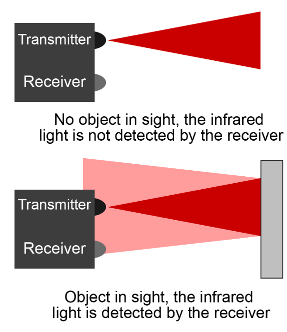
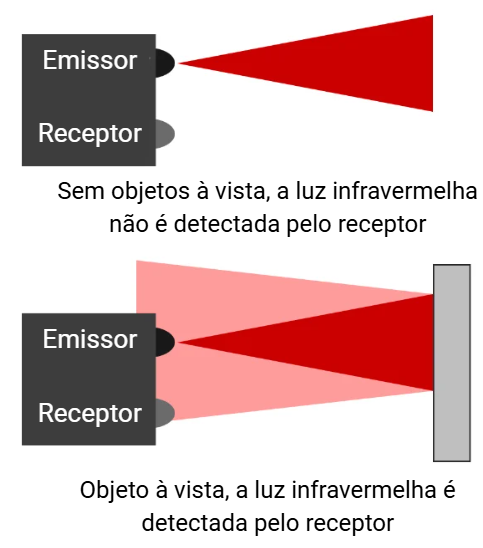

# RL001 — Digital Infrared Sensor [EN]
Para a versão em Português, [clique aqui](#pt)

---

## 🔗 Project Links

- 🔧 Hardware: [RobotLab/hardware/RL001](https://github.com/Bru-antunes/RobotLab/tree/main/hardware/RL001)
- 📚 Documentation: [RobotLab/docs/RL001](https://github.com/Bru-antunes/RobotLab/tree/main/docs/RL001)
- 🔖 References: [RobotLab/docs/References](https://github.com/Bru-antunes/RobotLab/tree/main/docs/References)

The adoption of open-source technologies has played a fundamental role in the democratization of mobile robotics, enabling academic teams, researchers, and independent developers to access electronic designs, technical documentation, and development methodologies without the limitations imposed by proprietary solutions. This approach reduces implementation costs, facilitates the reproduction and adaptation of projects, and encourages collaboration among different research groups, thereby contributing to the scientific and technological advancement of the field [Berry et al., 2023; Gabriel Soares Borges et al., 2025]. In the context of competitive robotics, where small performance improvements can represent a decisive advantage during a competition, the development of custom hardware becomes a strategy to increase the technological autonomy of teams and reduce dependence on imported commercial components.

Among the various subsystems that make up a mobile robot, sensing stands out for establishing the interface between the control system and the external environment, enabling the identification of obstacles, arena boundaries, and opponents [Pawłow et al., 2018; Mohd Shukri et al., 2025]. Thus, the choice of sensing technology directly influences the robot's perception capabilities and, consequently, its performance in autonomous tasks. Digital infrared sensors continue to be employed in mobile robotics applications due to their low cost, short response time, and ease of integration, although they present limitations related to ambient lighting conditions and the optical properties of the detected materials [Ang and Min, 2024].

In this context, the development of open-source digital infrared sensors represents an alternative capable of combining competitive performance, accessibility, and knowledge dissemination. In addition to enabling the adaptation of the hardware to the specific requirements of the application, the open availability of the design allows other teams to reproduce, study, and improve the proposed solution, strengthening the robotics community and promoting practices aligned with the principles of open science and collaborative engineering [Berry et al., 2023]. Accordingly, this document presents the development of an open-source digital infrared sensor intended for opponent detection in mini sumo robots, covering the state of the art of the technology, its operating principles, the electronic design, simulation, and implementation of the proposed circuit.

---

## Applications

The state of the art indicates that digital IR sensors remain relevant in both academic and industrial applications, especially when used in conjunction with other technologies or organized into distributed architectures. Comprehensive reviews, such as [Ang and Min, 2024], position infrared sensors within a broader ecosystem of perception technologies for mobile robots, including LiDAR, radar, ultrasonic sensors, and computer vision. Although they provide good accuracy and low failure rates in applications such as AGVs, these sensors have important limitations, including sensitivity to sunlight and difficulty detecting transparent or highly absorptive materials, characteristics that are also observed in *maker*-type digital IR sensors.

The literature further demonstrates that digital IR sensors can be applied beyond simple obstacle detection. The table below presents different applications of this technology described in the state of the art. In [Brahmaiah et al., 2022], for example, infrared sensors are employed for heart rate detection by exploiting subtle variations in infrared light absorption caused by blood flow. Although this application differs from opponent detection in mini-sumo robots, the underlying physical principle remains the same, highlighting the potential use of these sensors in more sensitive systems when combined with appropriate signal processing techniques. In automation and connected embedded systems, studies such as [Sarvaiya and Satange, 2022] demonstrate the integration of digital IR sensors with ultrasonic sensors and connectivity-enabled microcontrollers while preserving the basic binary output logic. More advanced approaches, such as the one presented in [Aula et al., 2024], show that the same infrared hardware can be repurposed for both obstacle detection and line-of-sight communication, expanding its functionality without requiring significant circuit modifications. Furthermore, the distributed use of these sensors is also explored in [Patel and Rohilla, 2020], where multiple IR sensors are employed to estimate traffic density and dynamically adjust control systems.

| **Application context**                 | **Specific use of the digital IR sensor**                                         |
| --------------------------------------- | --------------------------------------------------------------------------------- |
| Academic and industrial mobile robotics | Detection of opponents or obstacles in mobile robots and AGVs.                    |
| Experimental biomedical applications    | Heart rate detection through variations in infrared light absorption.             |
| Automation and embedded systems         | Presence detection integrated with microcontrollers and connected systems.        |
| Detection and communication             | Use of the IR sensor for both obstacle detection and line-of-sight communication. |
| Traffic monitoring                      | Estimation of traffic density based on the detection of passing vehicles.         |

**Table:** Applications of digital infrared sensors described in the state of the art. **Source:** RobotLab.

## Principles of Operation

The digital IR sensor operates based on a pair of electronic components: a transmitter (infrared LED), responsible for emitting infrared radiation that is invisible to the human eye, and a receiver (photodiode), which is sensitive to the same wavelength. Its operation occurs when the emitted light reaches the surface of an object and is reflected back to the receiver, changing its resistance and output voltage proportionally to the intensity of the received light [Ang and Min, 2024]. The figure below illustrates the operating principle of an IR sensor.

To process this signal, the sensor employs a comparator circuit, which compares the voltage generated by the photodiode with a predefined or adjustable threshold [Sarvaiya and Satange, 2022; Ajmera, 2017]. The result is a binary digital output (high/low), which informs the microcontroller of the presence of an obstacle [Patel and Rohilla, 2020]. Due to its versatility, this type of sensor is widely used in robotics for obstacle detection and avoidance in mobile robots [Ang and Min, 2024]. Furthermore, it can be used in communication systems between devices [Aula et al., 2024], healthcare applications [Brahmaiah et al., 2022], vehicle traffic monitoring [Patel and Rohilla, 2020], and home automation.

## Fabrication

Given the presented scenario, it was concluded that the development of open-source digital IR sensors represents the most coherent alternative from both technical and educational perspectives. By making the project openly available, it becomes possible for other teams, students, and researchers to reproduce, study, modify, and improve the sensor, promoting knowledge sharing and strengthening the robotics community  [Berry et al., 2023]. This approach reduces costs, expands access to technology, and encourages autonomy in hardware development, aligning with the principles of open science and collaborative engineering. Therefore, the in-house development of the opponent sensor not only meets the specific requirements of the developed robot but also contributes to the democratization of technological solutions in the field of mobile robotics. The developed digital infrared sensor circuit performs active reflection-based detection, using a modulated infrared signal to reduce the influence of environmental light noise. For assembly and development information, refer to [RobotLab/hardware/RL001](https://github.com/Bru-antunes/RobotLab/tree/main/hardware/RL001).

## Costs and Performance

In order to evaluate the performance of opponent detection sensors, three different types of infrared sensors were compared: a low-cost national sensor, an imported commercial sensor, and the sensor developed in this work. All sensors were positioned in the same location and oriented under the same experimental conditions, using a black surface as a reference, in order to ensure test uniformity and minimize external variables. The ambient light used in this study corresponds to sunlight. The first sensor considered corresponds to a national low-cost option, widely available on the market, without infrared signal modulation. This sensor is commercialized as an “obstacle sensor” and has an approximate cost of 4.00 BRL. The second analyzed sensor is an imported commercial model. This sensor features infrared signal modulation and provides better immunity to ambient light. Its average cost is approximately 12.50 USD, with shipping costs around 40.00 USD, which significantly increases the final acquisition cost. Finally, the sensor developed in this work was considered, with an average manufacturing cost of approximately 1.25 USD, with the costs detailed in the table below. It is important to highlight that the final value does not include shipping fees or labor costs, meaning that the average cost may vary depending on the method of component acquisition. In this project, all manufacturing and component acquisition were carried out nationally, which would increase the cost of building a sensor by approximately 5 USD, resulting in a total cost of around 6.25 USD. Even with the additional cost, the fabrication of the custom sensor remains 8 times cheaper than the imported commercial alternative, while still maintaining characteristics commonly required in academic and robotics applications, such as infrared signal modulation and greater immunity to ambient light interference.

| **Component** | **Main Function** | **Cost (USD)** |
|---------------|-------------------|---------------:|
| PCB | Electrical interconnection of the circuit | 0.32 |
| 100 nF Capacitor | Power supply filtering | 0.0047 |
| 1 nF Capacitor | NE555 frequency adjustment | 0.0146 |
| T4 Diode | Circuit protection | 0.0150 |
| Red LED | Visual indication | 0.0132 |
| NE555 | 38 kHz signal generation | 0.0296 |
| JST-GH Connector | Connection to the embedded system | 0.0670 |
| SFH-4545 | Infrared emission | 0.3380 |
| 220 Ω Resistor | LED current limiting | 0.0053 |
| 5.1 kΩ Resistor | NE555 frequency adjustment | 0.0053 |
| 1 kΩ Resistor | Output conditioning | 0.0053 |
| 15 kΩ Resistor | NE555 frequency adjustment | 0.0053 |
| 470 Ω Resistor | IR emitter current limiting | 0.0053 |
| TSSP4038 | Infrared signal reception | 0.3920 |
| SN74AHC1G14DBVR | Inverting buffer | 0.0316 |
| **TOTAL** |  | **1.2522** |

**Table:** Bill of materials, main functions, and estimated cost of the sensor. **Source:** RobotLab.

Range tests were performed at two different supply voltages (3.3 V and 5 V), which can be evaluated in the table below. The national sensor showed high sensitivity to light interference, especially variations caused by shadows and ambient sunlight, in addition to a reduced detection range. The imported sensor exhibited low interference from ambient light and good overall performance, demonstrating higher efficiency and stability compared to the national sensor. The sensor developed in this work presented superior performance compared to the others, combining low light interference with a high detection range.

| **Sensor** | **Supply Voltage** | **Range (cm)** |
| ---------- | -----------------: | -------------: |
| National   |              3.3 V |            ≈ 8 |
| National   |                5 V |            ≈ 8 |
| Imported   |              3.3 V |           ≈ 23 |
| Imported   |                5 V |           ≈ 40 |
| Developed  |              3.3 V |           ≈ 40 |
| Developed  |                5 V |           ≈ 44 |
**Table:** Comparison of opponent sensor performance. **Source:** RobotLab.

The analysis of the results demonstrates that the use of infrared signal modulation affected the performance of the evaluated sensors. Non-modulated sensors, such as the national model, showed high susceptibility to ambient light, since the receiver is unable to distinguish between the radiation emitted by the sensor itself and external continuous sources, such as artificial or solar lighting. On the other hand, in modulated sensors, the emitter operates at a specific frequency, allowing the receiver to be selective to this signal, rejecting external interference and significantly increasing detection reliability. Furthermore, modulation enables the use of internal filtering and amplification techniques in the receiver, increasing system sensitivity and allowing the detection of weaker reflected signals, which directly translates into a greater detection range. Therefore, modulation not only reduces interference but also enables an effective increase in the maximum detection distance, resulting in superior performance for sensors that employ this technique. Additionally, the variation in range as a function of the supply voltage observed in the modulated sensors is consistent with the expected behavior of the circuit. Increasing the voltage results in a higher current through the infrared emitter, increasing the emitted optical power and, consequently, the intensity of the received reflected signal. This expands the detection capability at greater distances, provided that the operational limits of the components are respected.

The obtained results demonstrate that the proposed sensor constitutes an efficient and accessible solution, outperforming the imported sensor while maintaining a significantly reduced cost and eliminating the critical limitations observed in the low-cost national sensor. Therefore, the developed sensor represents a viable alternative not only for the specific applications of this work but also for other competitive robotics teams, maker projects that require greater detection accuracy, and research projects that require reliable and high-quality infrared sensors. Moreover, the proposal to make the project available in an open-source format further increases its relevance, allowing students, researchers, and enthusiasts to reproduce, adapt, and improve it according to their needs. This characteristic directly contributes to the democratization of access to more robust technologies, promoting knowledge sharing and collaborative advancement in the field of robotics.

---
   

# RL001 — Sensor Digital Infravermelho [PT]

---
## 🔗 Links do Projeto

- 🔧 Hardware: [RobotLab/hardware/RL001](https://github.com/Bru-antunes/RobotLab/tree/main/hardware/RL001)
- 📚 Documentação: [RobotLab/docs/RL001](https://github.com/Bru-antunes/RobotLab/tree/main/docs/RL001)
- 🔖 Referências: [RobotLab/docs/References](https://github.com/Bru-antunes/RobotLab/tree/main/docs/References)

---

A adoção de tecnologias open source tem desempenhado um papel fundamental na democratização da robótica móvel, permitindo que equipes acadêmicas, pesquisadores e desenvolvedores independentes tenham acesso a projetos eletrônicos, documentação técnica e metodologias de desenvolvimento sem as limitações impostas por soluções proprietárias. Essa abordagem reduz custos de implementação, favorece a reprodução e adaptação de projetos e estimula a colaboração entre diferentes grupos de pesquisa, contribuindo para o avanço científico e tecnológico da área [Berry et al., 2023 ; Gabriel Soares Borges et al.,2025]. No contexto da robótica competitiva, em que pequenas melhorias de desempenho podem representar vantagem decisiva durante uma competição, o desenvolvimento de hardware próprio torna-se uma estratégia para aumentar a autonomia tecnológica das equipes e reduzir a dependência de componentes comerciais importados.

Entre os diversos subsistemas que compõem um robô móvel, o sensoriamento destaca-se por estabelecer a interface entre o sistema de controle e o ambiente externo, permitindo a identificação de obstáculos, limites da arena e oponentes [Pawłow et al., 2018 ; Mohd Shukri et al., 2025]. Dessa forma, a escolha da tecnologia de sensoriamento influencia diretamente a capacidade de percepção do robô e, consequentemente, seu desempenho em tarefas autônomas. Sensores infravermelhos digitais continuam sendo empregados em aplicações de robótica móvel devido ao seu baixo custo, reduzido tempo de resposta e simplicidade de integração, embora apresentem limitações relacionadas à iluminação ambiente e às propriedades ópticas dos materiais detectados [Ang and Min, 2024].

Nesse cenário, a fabricação de sensores infravermelhos digitais de código aberto representa uma alternativa capaz de conciliar desempenho competitivo, acessibilidade e disseminação do conhecimento. Além de possibilitar a adaptação do hardware às necessidades específicas da aplicação, a disponibilização aberta do projeto permite que outras equipes reproduzam, estudem e aprimorem a solução desenvolvida, fortalecendo a comunidade de robótica e incentivando práticas alinhadas aos princípios da ciência aberta e da engenharia colaborativa [Berry et al., 2023]. Assim, essa documentação apresenta o desenvolvimento de um sensor infravermelho digital open source destinado à detecção de oponentes em robôs de mini sumô, abordando o estado da arte da tecnologia, os fundamentos de funcionamento, o projeto eletrônico, a simulação e a implementação do circuito proposto. 

## Aplicações 

O estado da arte indica que sensores IR digitais permanecem relevantes em aplicações acadêmicas e industriais, especialmente quando utilizados em conjunto com outras tecnologias ou organizados em arquiteturas distribuídas. Revisões abrangentes, como  [Ang and Min, 2024], posicionam os sensores infravermelhos dentro de um ecossistema mais amplo de tecnologias de percepção para robôs móveis, incluindo LiDAR, radar, sensores ultrassônicos e visão computacional. Embora apresentem boa precisão e baixa taxa de falha em aplicações como AGVs, esses sensores possuem limitações importantes, como sensibilidade à luz solar e dificuldade na detecção de materiais transparentes ou altamente absorventes, características também observadas em sensores IR digitais do tipo *maker*.

A literatura demonstra ainda que sensores IR digitais podem ser aplicados além da simples detecção de obstáculos. A tabela abaixo apresenta diferentes aplicações dessa tecnologia descritas no estado da arte. Em [Brahmaiah et al., 2022], por exemplo, sensores infravermelhos são empregados na detecção de pulsos cardíacos, explorando variações sutis na absorção da luz infravermelha provocadas pelo fluxo sanguíneo. Embora essa aplicação seja distinta da detecção de oponentes em robôs de mini sumô, o princípio físico permanece o mesmo, evidenciando o potencial de utilização desses sensores em sistemas mais sensíveis quando associados a técnicas adequadas de processamento de sinais. Em aplicações de automação e sistemas embarcados conectados, trabalhos como  [Sarvaiya and Satange, 2022] demonstram a integração de sensores IR digitais com sensores ultrassônicos e microcontroladores dotados de conectividade, mantendo a lógica básica de saída binária. Já abordagens mais avançadas, como a apresentada em  [Aula et al., 2024],, mostram que o mesmo hardware infravermelho pode ser reutilizado tanto para detecção de obstáculos quanto para comunicação por linha de visão, ampliando sua funcionalidade sem alterações significativas no circuito. Além disso, o uso distribuído desses sensores também é explorado em  [Patel and Rohilla, 2020], no qual múltiplos sensores IR são empregados para estimar a densidade veicular e ajustar dinamicamente sistemas de controle.

| **Contexto de aplicação** | **Uso específico do sensor IR digital** |
|----------------------------|------------------------------------------|
| Robótica móvel acadêmica e industrial | Detecção de oponentes ou obstáculos em robôs móveis e AGVs. |
| Biomédica experimental | Detecção de pulsos cardíacos por variações na absorção da luz infravermelha. |
| Automação e sistemas embarcados | Detecção de presença integrada a microcontroladores e sistemas conectados. |
| Detecção e comunicação | Uso do sensor IR tanto para detecção de obstáculos quanto para comunicação por linha de visão. |
| Monitoramento de tráfego | Estimativa de densidade veicular a partir da detecção de passagem de veículos. |

**Tabela:** Aplicações de sensores infravermelhos digitais descritas no estado da arte. **Fonte:** RobotLab.

## Fundamentação

O sensor IR digital opera fundamentado em um par de componentes eletrônicos: um transmissor (LED infravermelho), responsável pela emissão de radiação infravermelha invisível ao olho humano, e um receptor (fotodiodo), sensível ao mesmo comprimento de onda. Seu funcionamento ocorre quando a luz emitida atinge a superfície de um objeto e é refletida de volta para o receptor, alterando sua resistência e a tensão de saída de forma proporcional à intensidade da luz recebida [Ang and Min, 2024]. A figura abaixo ilustra o princípio de funcionamento de um sensor IR.

Para processar esse sinal, o sensor utiliza um circuito comparador, que confronta a tensão gerada pelo fotodiodo com um limite predefinido ou ajustável [Sarvaiya and Satange, 2022; Ajmera, 2017]. O resultado é uma saída digital binária (alto/baixo), que informa ao microcontrolador a presença de um obstáculo [Patel and Rohilla, 2020]. Devido à sua versatilidade, esse tipo de sensor é amplamente empregado em robótica para detecção e desvio de obstáculos em robôs móveis [Ang and Min, 2024]. Além disso, pode ser utilizado em sistemas de comunicação entre dispositivos  [Aula et al., 2024], aplicações na área da saúde [Brahmaiah et al., 2022], monitoramento de tráfego de veículos [Patel and Rohilla, 2020] e automação residencial.

## Fabricação 

Diante do cenário apresentado, concluiu-se que a fabricação de sensores digitais IR com código aberto representa a alternativa mais coerente tanto do ponto de vista técnico quanto pedagógico. Ao disponibilizar o projeto de forma aberta, torna-se possível que outras equipes, estudantes e pesquisadores possam reproduzir, estudar, modificar e aprimorar o sensor, fomentando o compartilhamento de conhecimento e o fortalecimento da comunidade de robótica [Berry et al., 2023]. Essa abordagem reduz custos, amplia o acesso à tecnologia e estimula a autonomia no desenvolvimento de hardware, alinhando-se aos princípios de ciência aberta e engenharia colaborativa. Assim, a construção própria do sensor de oponente não apenas atende às necessidades específicas do robô desenvolvido, como também contribui para a democratização de soluções tecnológicas no cenário da robótica móvel. O circuito do sensor digital infravermelho desenvolvido realiza detecção ativa por reflexão, utilizando um sinal infravermelho modulado para reduzir a influência de ruídos luminosos do ambiente. Para informações de montagem e desenvolvimento, consulte [RobotLab/hardware/RL001](https://github.com/Bru-antunes/RobotLab/tree/main/hardware/RL001).

## Custo e Desempenho

Com o objetivo de avaliar o desempenho dos sensores de detecção de oponente, foram comparados três tipos distintos de sensores infravermelhos: um sensor nacional de baixo custo, um sensor importado comercial e o sensor desenvolvido neste trabalho. Todos os sensores foram posicionados no mesmo local e orientados sob as mesmas condições experimentais, utilizando uma superfície preta como referência, de modo a garantir uniformidade nos testes e minimizar variáveis externas. A luz ambiente utilizada para este estudo corresponde à luz solar. O primeiro sensor considerado corresponde a uma opção nacional, amplamente disponível no mercado, sem modulação do sinal infravermelho. Esse sensor é comercializado como “sensor de obstáculo” e possui custo aproximado de 4,00 BRL. O segundo sensor analisado é um modelo comercial importado. Este sensor possui modulação do sinal infravermelho e apresenta melhor imunidade à luz ambiente. Seu custo médio é de aproximadamente 12,50 USD, com frete em torno de 40,00 USD, o que eleva significativamente o custo final de aquisição. Por fim, foi considerado o sensor desenvolvido neste trabalho, cujo custo médio de fabricação foi de aproximadamente 1,25 USD, com os custos detalhados na Tabela abaixo. É importante destacar que o valor final não inclui taxas de envio nem custos de mão de obra, o que significa que o valor médio pode variar dependendo da forma de aquisição dos componentes. Neste projeto, toda a fabricação e aquisição de componentes foram realizadas nacionalmente, o que aumentaria o valor gasto para construir um sensor em cerca de 5 USD, tornando o custo total em torno de 6,25 USD. Mesmo com o custo extra, a confecção do sensor próprio permanece 8 vezes mais barata que a alternativa comercial importada, mantendo ainda características comumente exigidas em aplicações acadêmicas e de robótica, como modulação do sinal infravermelho e maior imunidade à interferência da luz ambiente. 

| **Componente**   | **Função principal**                | **Valor (USD)** |
| ---------------- | ----------------------------------- | --------------: |
| PCB              | Interconexão elétrica do circuito   |            0,32 |
| Capacitor 100 nF | Filtragem da alimentação            |          0,0047 |
| Capacitor 1 nF   | Ajuste da frequência do NE555       |          0,0146 |
| Diodo T4         | Proteção do circuito                |           0,015 |
| LED vermelho     | Indicação visual                    |          0,0132 |
| NE555            | Geração do sinal em 38 kHz          |          0,0296 |
| Conector JST-GH  | Conexão com o sistema embarcado     |           0,067 |
| SFH-4545         | Emissão infravermelha               |           0,338 |
| Resistor 220 Ω   | Limitação de corrente do LED        |          0,0053 |
| Resistor 5,1 kΩ  | Ajuste da frequência do NE555       |          0,0053 |
| Resistor 1 kΩ    | Condicionamento de saída            |          0,0053 |
| Resistor 15 kΩ   | Ajuste da frequência do NE555       |          0,0053 |
| Resistor 470 Ω   | Limitação de corrente do emissor IR |          0,0053 |
| TSSP4038         | Recepção do sinal infravermelho     |           0,392 |
| SN74AHC1G14DBVR  | Buffer inversor para inversão       |          0,0316 |
| **TOTAL**        |                                     |      **1,2522** |

**Tabela:** Lista de materiais, funcionalidade e custo estimado do sensor. **Fonte:** RobotLab.

Foram realizados testes de alcance em duas tensões de alimentação distintas (3,3 V e 5 V), que podem ser avaliados na Tabela abaixo. O sensor nacional apresentou alta sensibilidade à interferência luminosa, especialmente variações causadas por sombras e iluminação de luz ambiente (solar), além de alcance reduzido. O sensor importado apresentou baixa interferência da luz ambiente e bom desempenho geral, demonstrando eficiência e estabilidade superiores ao sensor nacional. Já o sensor desenvolvido neste trabalho apresentou desempenho superior aos demais, combinando baixa interferência luminosa com alcance elevado. 

| **Sensor**   | **Alimentação** | **Alcance (cm)** |
| ------------ | --------------: | ---------------: |
| Nacional     |           3,3 V |              ≈ 8 |
| Nacional     |             5 V |              ≈ 8 |
| Importado    |           3,3 V |             ≈ 23 |
| Importado    |             5 V |             ≈ 40 |
| Desenvolvido |           3,3 V |             ≈ 40 |
| Desenvolvido |             5 V |             ≈ 44 |
**Tabela:** Comparação de desempenho dos sensores de oponente. **Fonte:** RobotLab.

A análise dos resultados evidencia que o uso de modulação do sinal infravermelho alterou o desempenho dos sensores avaliados. Sensores não modulados, como o modelo nacional, apresentaram forte suscetibilidade à luz ambiente, uma vez que o receptor não consegue distinguir entre a radiação emitida pelo próprio sensor e fontes externas contínuas, como iluminação artificial ou solar. Por outro lado, nos sensores modulados, o emissor opera em uma frequência específica, permitindo que o receptor seja seletivo a esse sinal, rejeitando interferências externas e aumentando significativamente a confiabilidade da detecção. Além disso, a modulação possibilita o uso de técnicas internas de filtragem e amplificação no receptor, elevando a sensibilidade do sistema e permitindo a detecção de sinais refletidos mais fracos, o que se traduz diretamente em maior alcance. Dessa forma, a modulação não apenas reduz interferências, mas também viabiliza um aumento efetivo da distância máxima de detecção, o que gera um desempenho superior dos sensores que empregam essa técnica. Além disso, a variação do alcance em função da tensão de alimentação observada nos sensores modulados é coerente com o comportamento esperado do circuito. O aumento da tensão resulta em maior corrente no emissor infravermelho, elevando a potência óptica emitida e, consequentemente, a intensidade do sinal refletido recebido. Isso amplia a capacidade de detecção a maiores distâncias, desde que respeitados os limites operacionais dos componentes. 

Os resultados obtidos evidenciam que o sensor proposto constitui uma solução eficiente e acessível, superando o sensor importado em desempenho ao mesmo tempo em que mantém um custo significativamente reduzido, eliminando as limitações críticas observadas no sensor nacional de baixo custo. Dessa forma, o sensor desenvolvido se apresenta como uma alternativa viável não apenas para aplicações específicas deste trabalho, mas também para outras equipes de robótica competitiva, projetos makers que demandam maior precisão na detecção e pesquisas que necessitem de sensores infravermelhos confiáveis e de boa qualidade. Além disso, a proposta de disponibilização do projeto em formato open source amplia ainda mais sua relevância, permitindo que estudantes, pesquisadores e entusiastas possam reproduzi-lo, adaptá-lo e aprimorá-lo conforme suas necessidades. Essa característica contribui diretamente para a democratização do acesso a tecnologias mais robustas, promovendo o compartilhamento de conhecimento e o avanço colaborativo na área de robótica.
