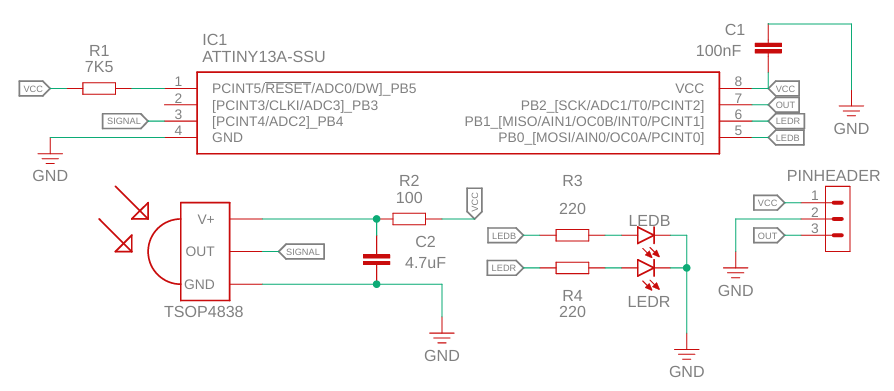
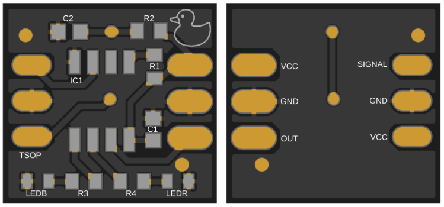

# MAR – Remote Activation Module [EN/PT]

---

## 📚 Reference, Motivation and Adaptation

This project is based on:

> **Antunes et al. (2025)** – *Development of a Low-Cost Remote Activation System for Competitive Sumo Robots*
> Available at: https://www.sba.org.br/open_journal_systems/index.php/sbai/article/view/5371

The original work presents a low-cost remote activation system for sumo robots using infrared communication based on the SIRC protocol at 38 kHz. Its main motivation is to ensure reliable, standardized, and interference-resistant activation during competitions.

Based on this work, the present project introduces adaptations focused on **modularity, ease of use, and hardware simplification**, aiming to create a portable and easily replicable solution.

Main adaptations:

* Modular hardware design
* Migration to ATTINY13A (size and cost reduction)
* Firmware rewritten from ATMEGA328P
* Timer and interrupt reconfiguration
* Falling-edge-only signal processing
* Noise filtering via timing constraints
* Full automation via scripts

---

## 🔗 Project Links

- 💻 Software: [RobotLab/software/MAR](https://github.com/Bru-antunes/RobotLab/tree/main/software/MAR)  
- 🔩 Hardware: [RobotLab/hardware/MAR](https://github.com/Bru-antunes/RobotLab/tree/main/hardware/MAR)

---

## 📐 Board Overview

The MAR (Remote Activation Module) hardware was designed to be **compact, lightweight, and easy to integrate** into competitive robotics platforms.

**Board dimensions:**  

📏 **X mm x Y mm** *(adjust after final PCB)*

**Component size standard:**  

📦 SMD **0603**

---

## 🖼️ Schematic

  

---

## 📷 PCB

  <!-- INSERT PCB PHOTO HERE -->

  

---

## 🔩 Bill of Materials (BOM)

| Reference | Value       | Description |
|-----------|------------|------------|
| R1        | 7.5 kΩ     | Pull-up resistor |
| R2        | 100 Ω      | TSOP auxiliary resistor |
| R3        | 220 Ω      | LED resistor |
| R4        | 220 Ω      | LED resistor |
| C1        | 100 nF     | Decoupling capacitor |
| C2        | 4.7 µF     | TSOP auxiliary capacitor |
| IC1       | ATTINY13A  | Microcontroller |
| TSOP      | TSOP4838   | Infrared receiver |
| LEDB      | Blue LED   | Status indicator |
| LEDR      | Red LED    | Status indicator |
| Pinhead   | 3 pins     | Power and signal connector |

---

## ⚙️ Circuit Description

### 🔹 TSOP4838

Infrared receiver module responsible for detecting **modulated IR signals at 38 kHz**.  

It includes internal filtering that rejects continuous light and environmental noise, ensuring reliable communication even in competitive environments.

---

### 🔹 ATTINY13A (IC1)

Microcontroller responsible for:

- Decoding the IR signal received from the TSOP  

- Interpreting the SIRC protocol  

- Controlling system outputs and status LEDs  

---

### 🔹 C1 – Decoupling Capacitor (100 nF)

Placed close to the microcontroller power pins.  

Its function is to:

- Filter high-frequency noise  

- Stabilize the supply voltage  

---

### 🔹 R1 – Pull-up Resistor (7.5 kΩ)

Connected to the RESET pin of the ATTINY13A.  

Ensures:

- Stable operation  

- Prevents unintended resets  

---

### 🔹 R2 and C2 – TSOP Auxiliary Network

These components follow the **datasheet recommendation** for the TSOP module.

They help:

- Improve noise immunity  

- Stabilize signal reception  

- Reduce false triggering  

---

### 🔹 R3 and R4 – LED Current Limiting

Resistors used to protect the LEDs by limiting current.

---

### 🔹 LEDB (Blue) and LEDR (Red)

Two programmable LEDs used for **visual feedback** of the system state:

- 🔵 Blue LED → idle / standby / armed states  

- 🔴 Red LED → activation / status indication  

These LEDs are essential for:

- Debugging  

- Competition readiness feedback  

---

### 🔹 Pinhead (3-pin header)

Provides connection for:

- Power (VCC)  

- Ground (GND)  

- Signal / output  

Designed for easy integration with robot systems.

---

## 🔌 Design Considerations

- Compact layout for small robots  

- Noise-resistant IR reception  

- Minimal component count  

- Easy soldering (0603 standard)  

- Modular integration via pin header  

---

## 🚀 Integration

The MAR hardware was designed to work seamlessly with the software tools:

- **MAR_setup** → environment configuration  

- **MAR_programmer** → firmware upload  

This ensures a **fast and reliable deployment pipeline** from hardware to operation.

---

# MAR – Módulo de Ativação Remota [EN/PT]

---

## 📚 Referência, Motivação e Adaptação

Este projeto foi inspirado no artigo:

> **Antunes et al. (2025)** – *Development of a Low-Cost Remote Activation System for Competitive Sumo Robots*
> Disponível em: https://www.sba.org.br/open_journal_systems/index.php/sbai/article/view/5371

O artigo apresenta um sistema de ativação remota baseado em infravermelho utilizando o protocolo SIRC em 38 kHz, com foco em confiabilidade e padronização em competições.

Este projeto adapta a solução com foco em:

* Modularização
* Redução de custo
* Facilidade de integração
* Miniaturização (ATTINY13A)

Principais modificações:

* Reescrita do firmware
* Alteração de registradores
* Reconfiguração de timers
* Tratamento de interrupções
* Filtragem de ruído por tempo
* Automação completa via scripts

---

## 🔗 Links do Projeto

- 💻 Software: [RobotLab/software/MAR](https://github.com/Bru-antunes/RobotLab/tree/main/software/MAR)  
- 🔩 Hardware: [RobotLab/hardware/MAR](https://github.com/Bru-antunes/RobotLab/tree/main/hardware/MAR)

---

## 📐 Visão Geral da Placa

O hardware do MAR (Módulo de Ativação Remota) foi projetado para ser **compacto, leve e de fácil integração** em plataformas de robótica competitiva.

**Dimensões da placa:**  

📏 **X mm x Y mm** *(ajustar após versão final da PCB)*

**Padrão de componentes:**  

📦 SMD **0603**

---

## 🖼️ Esquemático

  <!-- INSERIR IMAGEM DO ESQUEMÁTICO -->

  

---

## 📷 Placa (PCB)

  <!-- INSERIR FOTO DA PLACA -->

  

---

## 🔩 Lista de Componentes (BOM)

| Referência | Valor        | Descrição |
|------------|-------------|----------|
| R1         | 7.5 kΩ      | Resistor de pull-up |
| R2         | 100 Ω       | Resistor auxiliar do TSOP |
| R3         | 220 Ω       | Resistor para LED |
| R4         | 220 Ω       | Resistor para LED |
| C1         | 100 nF      | Capacitor de desacoplamento |
| C2         | 4.7 µF      | Capacitor auxiliar do TSOP |
| IC1        | ATTINY13A   | Microcontrolador |
| TSOP       | TSOP4838    | Receptor infravermelho |
| LEDB       | LED Azul    | Indicador de status |
| LEDR       | LED Vermelho| Indicador de status |
| Pinhead    | 3 pinos     | Conector de alimentação e sinal |

---

## ⚙️ Descrição do Circuito

### 🔹 TSOP4838

Módulo receptor infravermelho responsável por detectar **sinais modulados na frequência de 38 kHz**.  

Possui filtragem interna que rejeita:

- Luz contínua  

- Ruídos do ambiente  

Garantindo uma comunicação confiável mesmo em ambientes com múltiplos robôs.

---

### 🔹 ATTINY13A (IC1)

Microcontrolador responsável por:

- Decodificar o sinal recebido do TSOP  

- Interpretar o protocolo SIRC  

- Controlar os LEDs e a lógica do sistema  

---

### 🔹 C1 – Capacitor de Desacoplamento (100 nF)

Posicionado próximo aos pinos de alimentação do microcontrolador.  

Funções:

- Filtrar ruídos de alta frequência  

- Estabilizar a tensão de alimentação  

---

### 🔹 R1 – Resistor de Pull-up (7.5 kΩ)

Conectado ao pino de RESET do ATTINY13A.  

Garante:

- Funcionamento estável  

- Evita resets indesejados  

---

### 🔹 R2 e C2 – Rede Auxiliar do TSOP

Componentes recomendados pelo datasheet do TSOP.  

Responsáveis por:

- Melhorar a imunidade a ruídos  

- Estabilizar o sinal recebido  

- Reduzir leituras falsas  

---

### 🔹 R3 e R4 – Limitação de Corrente dos LEDs

Resistores utilizados para limitar a corrente que passa pelos LEDs, garantindo sua proteção.

---

### 🔹 LEDB (Azul) e LEDR (Vermelho)

LEDs programáveis utilizados para fornecer **feedback visual do estado do sistema**:

- 🔵 LED Azul → estados de espera / armado  

- 🔴 LED Vermelho → ativação / status  

Essenciais para:

- Debug  

- Indicação rápida durante competições  

---

### 🔹 Pinhead (Conector de 3 pinos)

Responsável pela conexão com o sistema externo:

- VCC (alimentação)  

- GND (terra)  

- Sinal  

Projetado para facilitar a integração com o robô.

---

## 🔌 Considerações de Projeto

- Layout compacto para robôs de pequeno porte  

- Recepção IR resistente a ruído  

- Baixa quantidade de componentes  

- Facilidade de soldagem (padrão 0603)  

- Integração modular via conector  

---

## 🚀 Integração

O hardware do MAR foi desenvolvido para funcionar em conjunto com as ferramentas de software:

- **MAR_setup** → configuração do ambiente  

- **MAR_programmer** → gravação do firmware  

Isso garante um fluxo completo de uso, do hardware até a operação.
