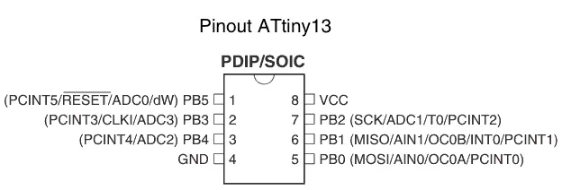

# MAR – Remote Activation Module [EN]
Para a versão em Português, [clique aqui](#pt)

---

## 📚 Reference, Motivation and Adaptation

This project is based on:

> **Antunes et al. (2025)** – *Development of a Low-Cost Remote Activation System for Competitive Sumo Robots*
> Available at: https://www.sba.org.br/open_journal_systems/index.php/sbai/article/view/5371

The original work presents a low-cost remote activation system for sumo robots using infrared communication based on the SIRC protocol at 38 kHz. Its main motivation is to ensure reliable, standardized, and interference-resistant activation during competitions.

**When referring to this project, please cite the paper above.**

Based on this work, the present project introduces adaptations focused on **modularity, ease of use, and hardware simplification**, aiming to create a portable and easily replicable solution.

Main adaptations:

* Modular hardware design
* Migration to ATTINY13A (size and cost reduction)
* Firmware rewritten from ATMEGA328P
* Timer and interrupt reconfiguration
* Falling-edge-only signal processing
* Noise filtering via timing constraints
* Full automation via scripts

---

## 🔗 Project Links

- 💻 Software: [RobotLab/software/MAR](https://github.com/Bru-antunes/RobotLab/tree/main/software/MAR)  
- 🔧 Hardware: [RobotLab/hardware/MAR](https://github.com/Bru-antunes/RobotLab/tree/main/hardware/MAR)
- 📚 Documentation: [RobotLab/docs/MAR](https://github.com/Bru-antunes/RobotLab/tree/main/docs/MAR)
---

<br>

## ⚙️ MAR System Overview

The MAR project includes two main automation tools:

<br>

### 🧩 MAR_setup.py

The **MAR_setup** script is responsible for preparing the development environment required for AVR microcontroller development.

#### What it does:

* Detects the operating system (Windows/Linux)
* Installs Python dependencies (`pyserial`)
* Installs AVR toolchain:

  * `avr-gcc` (compiler)
  * `avrdude` (programmer)
* Configures system PATH (Windows)
* Installs tools via `apt` (Linux)
* Generates VSCode configuration files:

  * `compile_commands.json`
  * `c_cpp_properties.json`

#### Purpose

It replaces all manual environment configuration steps required to compile and upload AVR firmware.

<br>

### 🤖 MAR_programmer.py

The **MAR_programmer** script automates the full firmware build and upload pipeline to the ATTINY13A.

#### What it does:

* Detects available serial (COM) ports
* Selects Arduino ISP automatically
* Verifies if Arduino is already configured as ISP
* Uploads ArduinoISP firmware if needed
* Tests communication with ATTINY13A
* Configures fuse bits (low fuse)
* Compiles firmware using `avr-gcc`
* Generates `.elf` and `.hex`
* Uploads firmware using `avrdude`

#### Full automated pipeline:

```bash
avr-gcc → avr-objcopy → avrdude (fuse + flash)
```

#### Purpose

It replaces all manual terminal commands required for:

* compilation
* firmware conversion
* flashing
* hardware validation

<br><br>

---

<br><br>


## 🔌 Programming Hardware Setup 

For programming the ATTINY13A, it is **strongly recommended** to use an **EEPROM test clip (SOIC clip)**. This allows programming the microcontroller **directly on the board**, without the need for desoldering, making the process faster, safer, and more practical.

In this project, an **Arduino Uno configured as ISP (In-System Programmer)** was used to perform the programming.


### 📷 ATTINY13A Pinout

<p align="center">
  
</p>


### 🔗 Wiring (Arduino ISP → ATTINY13A)

The connection can be made using jumper wires as follows:

```
Arduino ____________ ATtiny13(A)

5V      ----------------> Pin 8
GND     ----------------> Pin 4
Pin 13  ----------------> Pin 7
Pin 12  ----------------> Pin 6
Pin 11  ----------------> Pin 5
Pin 10  ----------------> Pin 1
```
<br><br>

---

<br><br>

## 🛠️ Manual Installation (Without MAR_setup and MAR_programmer) 

This section describes how to reproduce the entire workflow manually.
<br><br>
### 🪟 Windows Manual Setup 

#### 1. Install required tools

##### 🔹 Install Python

Download from:
[https://www.python.org/downloads/](https://www.python.org/downloads/)

Make sure to enable:

* ✅ “Add Python to PATH”

##### 🔹 Install AVR-GCC toolchain

Download AVR toolchain:

* avr-gcc (Microchip AVR 8-bit GNU Toolchain)

Extract to:

```
C:\avr
```

##### 🔹 Install AVRDude

Download:

* avrdude Windows release

Extract to:

```
C:\avrdude
```


#### 2. Add tools to PATH

Open:

> System Environment Variables → PATH

Add:

```
C:\avr\bin
C:\avrdude
```

Restart terminal after this step.

#### 3. Install Python dependency

```bash
pip install pyserial==3.5
```

#### 4. Verify installation

```bash
avr-gcc --version
avrdude -v
```
<br><br>

### 🐧 Linux Manual Setup 

#### 1. Install AVR tools

```bash
sudo apt update
sudo apt install avr-gcc avrdude python3-pip
```


#### 2. Install Python dependency

```bash
pip3 install pyserial==3.5
```


#### 3. Verify installation

```bash
avr-gcc --version
avrdude -v
```
<br><br>

### ⚙️ Arduino ISP Setup (Windows/Linux) 

Before programming the ATTINY13A:

1. Open Arduino IDE
2. Load example:

   ```
   File → Examples → ArduinoISP
   ```
3. Upload to Arduino UNO

This configures the Arduino as an ISP programmer.

<br><br>

### 🔥 Manual Compilation & Upload (Windows/Linux) 

#### 1. Configure fuse (ATTINY13A)

```bash
avrdude -c arduino -p t13 -P COMX -b 19200 -U lfuse:w:0x7A:m
```


#### 2. Compile firmware

```bash
avr-gcc -mmcu=attiny13 -Os -DF_CPU=9600000UL -o MAR.elf MAR.c
```


#### 3. Generate HEX file

```bash
avr-objcopy -O ihex MAR.elf MAR.hex
```


#### 4. Upload firmware

```bash
avrdude -c arduino -p t13 -P COMX -b 19200 -B 10 -U flash:w:MAR.hex
```

Replace `COMX` with your serial port:

* Windows: `COM3`, `COM4`, etc.
* Linux: `/dev/ttyUSB0`, `/dev/ttyACM0`
  
<br><br>

### 🧠 Summary of Manual Flow

1. Install AVR toolchain
2. Configure PATH
3. Upload ArduinoISP
4. Connect board
5. Set fuse with avrdude
6. Compile with avr-gcc
7. Convert ELF → HEX
8. Upload firmware via ISP

<br><br>

---

<br><br>


## ⚠️ Important Notes

* Ensure the Arduino is loaded with the **ArduinoISP** sketch before use
* Double-check all connections before powering the system
* Poor contact (especially with clips) may cause programming failure
* Designed for ATTINY13A
* Requires ISP programmer (Arduino as ISP supported)


  <br><br>


# MAR – Módulo de Ativação Remota [PT]
<a name="pt"> </a>

---

## 📚 Referência, Motivação e Adaptação

Este projeto é baseado em:

> **Antunes et al. (2025)** – *Desenvolvimento de um Sistema de Ativação Remota de Baixo Custo para Robôs de Sumô Competitivos*  
> Disponível em: https://www.sba.org.br/open_journal_systems/index.php/sbai/article/view/5371

O trabalho original apresenta um sistema de ativação remota de baixo custo para robôs de sumô utilizando comunicação infravermelha baseada no protocolo SIRC a 38 kHz. Sua principal motivação é garantir uma ativação confiável, padronizada e resistente a interferências durante competições.

**Ao se referir a este projeto, por favor cite o artigo acima.**

Com base nesse trabalho, o presente projeto introduz adaptações focadas em **modularidade, facilidade de uso e simplificação de hardware**, visando criar uma solução portátil e facilmente replicável.

Principais adaptações:

* Design de hardware modular  
* Migração para ATTINY13A (redução de tamanho e custo)  
* Firmware reescrito a partir do ATMEGA328P  
* Reconfiguração de timers e interrupções  
* Processamento apenas de borda de descida  
* Filtragem de ruído via restrições de tempo  
* Automação completa via scripts  

---

## 🔗 Links do Projeto

- 💻 Software: [RobotLab/software/MAR](https://github.com/Bru-antunes/RobotLab/tree/main/software/MAR)  
- 🔧 Hardware: [RobotLab/hardware/MAR](https://github.com/Bru-antunes/RobotLab/tree/main/hardware/MAR)  
- 📚 Documentação: [RobotLab/docs/MAR](https://github.com/Bru-antunes/RobotLab/tree/main/docs/MAR)

---

<br>


## ⚙️ Visão Geral do Sistema MAR

O projeto MAR inclui duas principais ferramentas de automação:

<br>

### 🧩 MAR_setup.py

O script **MAR_setup** é responsável por preparar o ambiente de desenvolvimento necessário para o desenvolvimento com microcontroladores AVR.

#### O que ele faz:

* Detecta o sistema operacional (Windows/Linux)
* Instala dependências Python (`pyserial`)
* Instala a toolchain AVR:

  * `avr-gcc` (compilador)
  * `avrdude` (programador)
* Configura o PATH do sistema (Windows)
* Instala ferramentas via `apt` (Linux)
* Gera arquivos de configuração do VSCode:

  * `compile_commands.json`
  * `c_cpp_properties.json`

#### Finalidade

Substitui todas as etapas manuais de configuração de ambiente necessárias para compilar e enviar firmware AVR.

<br>

### 🤖 MAR_programmer.py

O script **MAR_programmer** automatiza todo o pipeline de compilação e gravação de firmware no ATTINY13A.

#### O que ele faz:

* Detecta portas seriais disponíveis (COM)
* Seleciona automaticamente o Arduino ISP
* Verifica se o Arduino já está configurado como ISP
* Envia o firmware ArduinoISP caso necessário
* Testa comunicação com o ATTINY13A
* Configura os fuse bits (low fuse)
* Compila o firmware usando `avr-gcc`
* Gera arquivos `.elf` e `.hex`
* Faz upload do firmware usando `avrdude`

#### Pipeline automatizado completo:

```bash
avr-gcc → avr-objcopy → avrdude (fuse + flash)
```

#### Finalidade

Substitui todos os comandos manuais de terminal necessários para:

* compilação
* conversão de firmware
* gravação (flash)
* validação de hardware
  
<br><br>

---

<br><br>


## 🔌 Configuração do Hardware de Programação

Para programar o ATTINY13A, é **altamente recomendado** o uso de uma **garra de teste EEPROM (SOIC clip)**. Isso permite programar o microcontrolador **diretamente na placa**, sem necessidade de dessoldagem, tornando o processo mais rápido, seguro e prático.

Neste projeto, foi utilizado um **Arduino Uno configurado como ISP (In-System Programmer)** para realizar a programação.

### 📷 Pinagem do ATTINY13A

<p align="center">
  
</p>

### 🔗 Ligação (Arduino ISP → ATTINY13A)

A conexão pode ser feita com fios jumper da seguinte forma:

```
Arduino ____________ ATtiny13(A)

5V      ----------------> Pino 8
GND     ----------------> Pino 4
Pino 13 ----------------> Pino 7
Pino 12 ----------------> Pino 6
Pino 11 ----------------> Pino 5
Pino 10 ----------------> Pino 1
```
<br><br>

---

<br><br>


## 🛠️ Instalação Manual (Sem MAR_setup e MAR_programmer)

Esta seção descreve como reproduzir todo o fluxo manualmente.

<br><br>

### 🪟 Configuração Manual no Windows

#### 1. Instalar ferramentas necessárias

##### 🔹 Instalar Python

Baixe em:
[https://www.python.org/downloads/](https://www.python.org/downloads/)

Certifique-se de habilitar:

* ✅ “Add Python to PATH”

##### 🔹 Instalar toolchain AVR-GCC

Baixe a toolchain AVR:

* avr-gcc (Microchip AVR 8-bit GNU Toolchain)

Extraia para:

```
C:\avr
```

##### 🔹 Instalar AVRDude

Baixe:

* versão Windows do avrdude

Extraia para:

```
C:\avrdude
```


#### 2. Adicionar ferramentas ao PATH

Abra:

> Variáveis de Ambiente do Sistema → PATH

Adicione:

```
C:\avr\bin
C:\avrdude
```

Reinicie o terminal após isso.

#### 3. Instalar dependência Python

```bash
pip install pyserial==3.5
```


#### 4. Verificar instalação

```bash
avr-gcc --version
avrdude -v
```

<br><br>

### 🐧 Configuração Manual no Linux

#### 1. Instalar ferramentas AVR

```bash
sudo apt update
sudo apt install avr-gcc avrdude python3-pip
```


#### 2. Instalar dependência Python

```bash
pip3 install pyserial==3.5
```


#### 3. Verificar instalação

```bash
avr-gcc --version
avrdude -v
```

<br><br>


### ⚙️ Configuração do Arduino ISP (Windows/Linux)

Antes de programar o ATTINY13A:

1. Abra o Arduino IDE
2. Vá em:

   ```
   File → Examples → ArduinoISP
   ```
3. Faça upload para o Arduino UNO

Isso configura o Arduino como programador ISP.

<br><br>


### 🔥 Compilação e Gravação Manual (Windows/Linux)

#### 1. Configurar fuse (ATTINY13A)

```bash
avrdude -c arduino -p t13 -P COMX -b 19200 -U lfuse:w:0x7A:m
```


#### 2. Compilar firmware

```bash
avr-gcc -mmcu=attiny13 -Os -DF_CPU=9600000UL -o MAR.elf MAR.c
```


#### 3. Gerar arquivo HEX

```bash
avr-objcopy -O ihex MAR.elf MAR.hex
```


#### 4. Fazer upload do firmware

```bash
avrdude -c arduino -p t13 -P COMX -b 19200 -B 10 -U flash:w:MAR.hex
```

Substitua `COMX` pela sua porta serial:

* Windows: `COM3`, `COM4`, etc.
* Linux: `/dev/ttyUSB0`, `/dev/ttyACM0`

<br><br>


### 🧠 Resumo do Fluxo Manual

1. Instalar toolchain AVR
2. Configurar PATH
3. Fazer upload do ArduinoISP
4. Conectar hardware
5. Configurar fuse com avrdude
6. Compilar com avr-gcc
7. Converter ELF → HEX
8. Fazer upload via ISP

<br><br>


---
<br><br>


## ⚠️ Notas Importantes

* Certifique-se de que o Arduino está com o sketch **ArduinoISP** antes de usar
* Verifique todas as conexões antes de energizar o sistema
* Mau contato (principalmente em clips) pode causar falha na programação
* Projetado para ATTINY13A
* Requer programador ISP (Arduino como ISP suportado)


